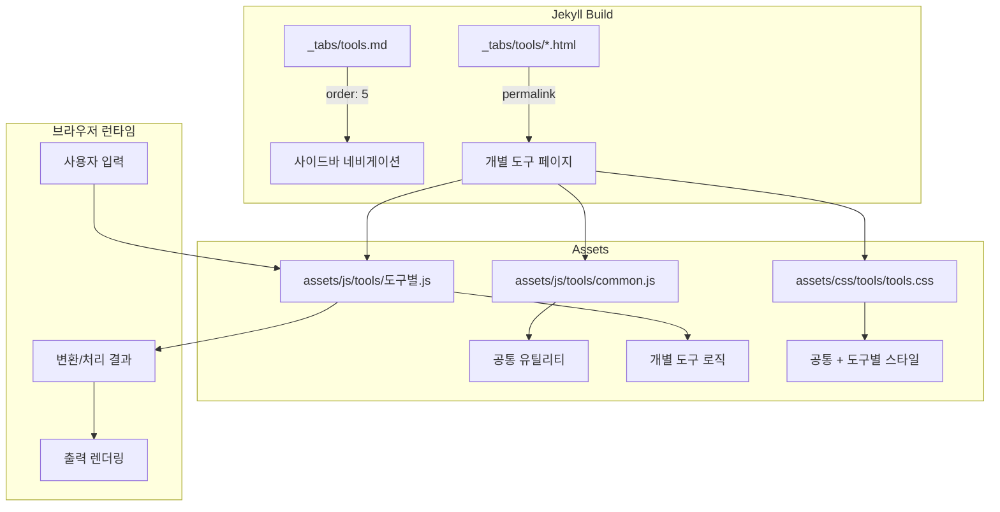

# 기술 설계 문서: 개발자 도구 페이지

## 개요

Jekyll 기반 Chirpy 테마 블로그(blog.kikyung.com)에 8개의 클라이언트 사이드 개발자 유틸리티 도구를 제공하는 Tools Hub 페이지를 구축한다. 모든 도구는 서버 없이 순수 JavaScript로 동작하며, Chirpy 테마의 `_tabs` 컬렉션과 `page` 레이아웃을 활용하여 기존 블로그 구조에 자연스럽게 통합된다.

### 핵심 설계 원칙

1. **서버리스**: 모든 로직은 브라우저 내 JavaScript로만 처리 (GitHub Pages 호환)
2. **테마 통합**: Chirpy 테마의 다크/라이트 모드, 반응형 레이아웃을 그대로 활용
3. **모듈화**: 각 도구는 독립적인 JS/CSS 파일로 분리하여 유지보수성 확보
4. **일관된 UX**: 공통 UI 컴포넌트(토스트, 클립보드 복사, 2패널 레이아웃)를 재사용

## 아키텍처

### 전체 구조



### 파일 구조

```
_tabs/
  tools.md                          # Tools Hub 메인 탭 (order: 5)

_layouts/
  tool.html                         # 개별 도구 페이지용 커스텀 레이아웃

_tools/                             # 개별 도구 페이지 컬렉션
  timestamp-converter.html
  cron-interpreter.html
  regex-tester.html
  markdown-table-generator.html
  color-converter.html
  metadata-generator.html
  para-classifier.html
  prompt-optimizer.html

assets/
  js/tools/
    common.js                       # 공통 유틸리티 (클립보드, 토스트 등)
    timestamp-converter.js
    cron-interpreter.js
    regex-tester.js
    markdown-table-generator.js
    color-converter.js
    metadata-generator.js
    para-classifier.js
    prompt-optimizer.js
  css/tools/
    tools.css                       # 공통 + 도구별 스타일 통합
```

### 설계 결정 사항

**결정 1: `_tools/` 컬렉션 대신 `_tabs/tools/` 하위 경로 사용 여부**

Chirpy 테마의 `_tabs` 컬렉션은 `permalink: /:title/` 기본값을 사용한다. 개별 도구 페이지는 `_tabs` 컬렉션에 포함시키면 사이드바에 모두 노출되는 문제가 있다. 따라서 개별 도구 페이지는 일반 페이지(`pages/tools/`)로 배치하고, `layout: tool`을 사용하여 일관된 도구 UI를 제공한다.

→ **결정**: 개별 도구 페이지는 `pages/tools/` 폴더에 HTML 파일로 배치하고, `permalink: /tools/도구명/`을 명시적으로 설정한다. Tools Hub(`_tabs/tools.md`)만 사이드바에 노출된다.

**결정 2: CSS 파일 분리 전략**

도구별 CSS를 개별 파일로 분리하면 HTTP 요청이 증가한다. 모든 도구의 스타일을 하나의 `tools.css`로 통합하면 관리가 간편하고, 각 도구 페이지에서 하나의 CSS만 로드하면 된다.

→ **결정**: `assets/css/tools/tools.css` 하나의 파일에 공통 스타일과 도구별 스타일을 모두 포함한다.

**결정 3: JavaScript 모듈 로딩 방식**

각 도구 페이지는 `common.js`(공통 유틸리티)와 해당 도구의 JS 파일만 로드한다. ES Module(`type="module"`)은 Jekyll/GitHub Pages 환경에서 MIME 타입 이슈가 발생할 수 있으므로, 전통적인 `<script>` 태그 방식을 사용한다.

→ **결정**: `<script src>` 태그로 `common.js` → 도구별 JS 순서로 로드한다.

## 컴포넌트 및 인터페이스

### 1. 공통 유틸리티 (`common.js`)

```javascript
// 클립보드 복사 + 토스트 알림
function copyToClipboard(text, toastMessage = '복사 완료')

// 토스트 알림 표시
function showToast(message, duration = 2000)

// 입력 유효성 검사 후 오류 메시지 표시
function showError(elementId, message)
function clearError(elementId)

// Chirpy 다크/라이트 모드 감지
function isDarkMode()
function onThemeChange(callback)
```

### 2. 도구 레이아웃 (`_layouts/tool.html`)

`default` 레이아웃을 상속하며, 도구 페이지 공통 구조를 제공한다:
- 도구 이름, 설명, 사용법 안내 헤더
- 2패널 레이아웃 (입력/출력 영역)
- 공통 CSS/JS 자동 로드
- SEO 메타 태그 (`title`, `description`)

Front Matter 인터페이스:
```yaml
---
layout: tool
title: "도구 이름"
description: "도구 설명 (SEO용)"
tool_icon: "fas fa-clock"        # Font Awesome 아이콘
tool_description: "도구 간단 설명"
tool_usage: "사용법 안내 텍스트"
permalink: /tools/도구-슬러그/
---
```

### 3. Tools Hub 페이지 (`_tabs/tools.md`)

```yaml
---
layout: page
icon: fas fa-tools
order: 5
title: Tools
---
```

카테고리별 카드 그리드로 도구 목록을 표시한다:
- **개발자 유틸리티**: 타임스탬프 변환기, Cron 해석기, 정규표현식 테스터, Markdown 테이블 생성기, 색상 변환기
- **생산성/지식 관리**: Obsidian Metadata Generator, PARA 분류 도우미
- **AI 활용**: AI 프롬프트 최적화 도구

### 4. 개별 도구 컴포넌트 인터페이스

각 도구의 JavaScript는 다음 패턴을 따른다:

```javascript
document.addEventListener('DOMContentLoaded', function() {
    // 초기화
    initTool();
    
    // 이벤트 바인딩
    bindEvents();
});

function initTool() { /* 초기 상태 설정 */ }
function bindEvents() { /* 입력 이벤트 리스너 등록 */ }
function processInput(input) { /* 핵심 변환 로직 - 순수 함수 */ }
function renderOutput(result) { /* 결과를 DOM에 렌더링 */ }
```

#### 도구별 핵심 함수 시그니처

**타임스탬프 변환기**
```javascript
function timestampToDate(timestamp)    // number → { iso: string, readable: string, ms: number, sec: number }
function dateToTimestamp(dateString)    // string → { sec: number, ms: number }
function detectTimestampUnit(value)    // number → 'seconds' | 'milliseconds'
```

**Cron 해석기**
```javascript
function parseCron(expression)         // string → { type: '5-field'|'6-field', fields: CronField[], description: string }
function getNextExecutions(expression, count, timezone) // string, number, string → Date[]
function describeField(field, type)    // CronField, string → string
```

**정규표현식 테스터**
```javascript
function testRegex(pattern, flags, testString) // string, string, string → MatchResult[]
// MatchResult: { fullMatch: string, groups: Group[], start: number, end: number }
```

**Markdown 테이블 생성기**
```javascript
function generateMarkdownTable(data, alignments) // string[][], string[] → string
function parseTableSize(rows, cols)              // number, number → string[][]
```

**색상 변환기**
```javascript
function hexToRgb(hex)     // string → { r: number, g: number, b: number } | null
function rgbToHex(r, g, b) // number, number, number → string
function rgbToHsl(r, g, b) // number, number, number → { h: number, s: number, l: number }
function hslToRgb(h, s, l) // number, number, number → { r: number, g: number, b: number }
```

**Obsidian Metadata Generator**
```javascript
function generateYaml(fields)    // Object → string
function parseYaml(yamlString)   // string → Object
```

**PARA 분류 도우미**
```javascript
function classifyPARA(title, description, checklist) // string, string, Object → { category: string, confidence: string, folderPath: string }
```

**AI 프롬프트 최적화 도구**
```javascript
function buildPrompt(sections)           // PromptSections → string
function applyTechnique(technique, sections) // string, PromptSections → PromptSections
```

## 데이터 모델

### 도구 카드 데이터 (Tools Hub)

```javascript
const TOOL_CATEGORIES = [
  {
    name: '개발자 유틸리티',
    icon: 'fas fa-code',
    tools: [
      { name: '타임스탬프 변환기', slug: 'timestamp-converter', icon: 'fas fa-clock', description: 'Unix 타임스탬프 ↔ 날짜/시간 양방향 변환' },
      { name: 'Cron 표현식 해석기', slug: 'cron-interpreter', icon: 'fas fa-calendar-alt', description: 'Cron 표현식을 한국어로 해석하고 다음 실행 시각 계산' },
      { name: '정규표현식 테스터', slug: 'regex-tester', icon: 'fas fa-search', description: '정규표현식 패턴 테스트 및 매칭 결과 실시간 확인' },
      { name: 'Markdown 테이블 생성기', slug: 'markdown-table-generator', icon: 'fas fa-table', description: '행/열 지정으로 Markdown 테이블 코드 생성' },
      { name: '색상 변환기', slug: 'color-converter', icon: 'fas fa-palette', description: 'HEX/RGB/HSL 색상 형식 간 양방향 변환' }
    ]
  },
  {
    name: '생산성/지식 관리',
    icon: 'fas fa-brain',
    tools: [
      { name: 'Obsidian Metadata Generator', slug: 'metadata-generator', icon: 'fas fa-file-code', description: 'Obsidian 노트용 YAML Front Matter 생성' },
      { name: 'PARA 분류 도우미', slug: 'para-classifier', icon: 'fas fa-sitemap', description: 'PARA 방법론 기반 노트/정보 분류 도우미' }
    ]
  },
  {
    name: 'AI 활용',
    icon: 'fas fa-robot',
    tools: [
      { name: 'AI 프롬프트 최적화', slug: 'prompt-optimizer', icon: 'fas fa-magic', description: 'AI 프롬프트 구조화 및 기법 적용' }
    ]
  }
];
```

### Cron 필드 모델

```javascript
// CronField
{
  raw: string,          // 원본 필드 값 (예: "*/5")
  type: string,         // 필드 타입 (second|minute|hour|dayOfMonth|month|dayOfWeek)
  values: number[],     // 파싱된 값 배열
  description: string   // 한국어 설명
}
```

### 정규표현식 매칭 결과 모델

```javascript
// MatchResult
{
  fullMatch: string,
  groups: [
    { index: number, name: string|null, value: string }
  ],
  start: number,
  end: number
}
```

### 색상 모델

```javascript
// ColorValue
{
  hex: string,                    // "#FF5733"
  rgb: { r: number, g: number, b: number },  // { r: 255, g: 87, b: 51 }
  hsl: { h: number, s: number, l: number }   // { h: 11, s: 100, l: 60 }
}
```

### Obsidian Metadata 모델

```javascript
// MetadataFields
{
  title: string,
  date: string,           // ISO 8601 (Asia/Seoul)
  tags: string[],
  categories: string[],
  aliases: string[],
  cssclass: string,
  customFields: [
    { key: string, value: string }
  ]
}
```

### PARA 분류 모델

```javascript
// PARAResult
{
  category: 'Projects' | 'Areas' | 'Resources' | 'Archives',
  confidence: 'high' | 'medium' | 'low',
  reasoning: string,
  folderPath: string,     // 예: "1_Projects/프로젝트명"
  checklist: {
    hasDeadline: boolean,
    hasDeliverable: boolean,
    isOngoing: boolean,
    isReference: boolean,
    isInactive: boolean
  }
}
```

### 프롬프트 섹션 모델

```javascript
// PromptSections
{
  role: string,
  context: string,
  instruction: string,
  format: string,
  constraints: string,
  technique: string|null   // 'chain-of-thought' | 'few-shot' | 'zero-shot' | null
}
```


## 정확성 속성 (Correctness Properties)

*정확성 속성(Property)은 시스템의 모든 유효한 실행에서 참이어야 하는 특성 또는 동작이다. 사람이 읽을 수 있는 명세와 기계가 검증 가능한 정확성 보장 사이의 다리 역할을 한다.*

### Property 1: 타임스탬프 변환 라운드트립

*For any* 유효한 Unix 타임스탬프(초 단위, 0 ~ 2^31-1 범위), `timestampToDate`로 날짜 문자열로 변환한 후 `dateToTimestamp`로 다시 변환하면, 원래 타임스탬프와 동일한 값을 반환해야 한다.

**Validates: Requirements 3.6**

### Property 2: 타임스탬프 단위 자동 감지

*For any* 유효한 Unix 타임스탬프에 대해, 초 단위 값(10자리 이하)은 `'seconds'`로, 밀리초 단위 값(13자리)은 `'milliseconds'`로 감지해야 한다. 즉, `detectTimestampUnit(ts)` 결과가 자릿수 기반 규칙과 일치해야 한다.

**Validates: Requirements 3.4**

### Property 3: Cron 표현식 필드 수 감지

*For any* 공백으로 구분된 5개 필드를 가진 문자열은 `'5-field'`(리눅스 crontab)로, 6개 필드를 가진 문자열은 `'6-field'`(Spring)로 감지해야 한다. 즉, `parseCron(expr).type`이 필드 수와 일치해야 한다.

**Validates: Requirements 4.2**

### Property 4: Cron 해석 멱등성

*For any* 유효한 Cron 표현식에 대해, `parseCron`을 두 번 호출하면 동일한 한국어 설명(`description`)을 반환해야 한다. 즉, `parseCron(expr).description === parseCron(expr).description`이 항상 참이어야 한다.

**Validates: Requirements 4.8**

### Property 5: 정규표현식 매칭 결과 구조 정합성

*For any* 유효한 정규표현식 패턴과 테스트 문자열에 대해, `testRegex` 함수가 반환하는 각 `MatchResult`의 `start`와 `end` 인덱스로 테스트 문자열을 슬라이스하면 `fullMatch`와 동일해야 하며, 반환된 총 매칭 수는 `MatchResult` 배열의 길이와 일치해야 한다.

**Validates: Requirements 5.3, 5.7**

### Property 6: Markdown 테이블 정렬 구분선 생성

*For any* 정렬 옵션 배열(각 원소가 `'left'`, `'center'`, `'right'` 중 하나)에 대해, `generateMarkdownTable`이 생성한 Markdown의 두 번째 행(구분선)에서 `'left'`는 `:---`, `'center'`는 `:---:`, `'right'`는 `---:` 패턴을 포함해야 한다.

**Validates: Requirements 6.4, 6.5, 6.6**

### Property 7: Markdown 테이블 데이터 보존

*For any* 비어있지 않은 2차원 문자열 배열(테이블 데이터)에 대해, `generateMarkdownTable`이 생성한 Markdown 문자열은 입력 배열의 모든 셀 값을 포함해야 한다.

**Validates: Requirements 6.2, 6.10**

### Property 8: 테이블 그리드 크기 정합성

*For any* 양의 정수 행(rows)과 열(cols)에 대해, `parseTableSize(rows, cols)`가 반환하는 2차원 배열의 행 수는 `rows`와 같고, 각 행의 열 수는 `cols`와 같아야 한다.

**Validates: Requirements 6.1**

### Property 9: HEX ↔ RGB 라운드트립

*For any* 유효한 6자리 HEX 색상 코드(`#RRGGBB`)에 대해, `hexToRgb`로 RGB로 변환한 후 `rgbToHex`로 다시 변환하면, 원래 HEX 값과 동일해야 한다(대소문자 무시).

**Validates: Requirements 7.9**

### Property 10: RGB ↔ HSL 라운드트립

*For any* 유효한 RGB 값(각 0~255 정수)에 대해, `rgbToHsl`로 HSL로 변환한 후 `hslToRgb`로 다시 변환하면, 원래 RGB 값과 각 채널 ±1 범위 내에서 일치해야 한다(부동소수점 반올림 허용).

**Validates: Requirements 7.10**

### Property 11: YAML 메타데이터 라운드트립

*For any* 유효한 메타데이터 필드 집합(title, tags, categories, 커스텀 필드 포함)에 대해, `generateYaml`로 YAML 문자열을 생성한 후 `parseYaml`로 파싱하면, 원래 입력한 모든 필드 값이 보존되어야 한다.

**Validates: Requirements 8.6**

### Property 12: PARA 분류 결과 유효성

*For any* 비어있지 않은 제목과 설명 문자열에 대해, `classifyPARA` 함수는 반드시 `'Projects'`, `'Areas'`, `'Resources'`, `'Archives'` 중 하나의 카테고리를 반환해야 하며, 해당 카테고리에 맞는 유효한 폴더 경로(`1_Projects/`, `2_Areas/`, `3_Resources/`, `4_Archives/` 중 하나로 시작)를 포함해야 한다.

**Validates: Requirements 9.2, 9.4**

### Property 13: 프롬프트 빌드 섹션 포함

*For any* 비어있지 않은 PromptSections(role, context, instruction, format, constraints)에 대해, `buildPrompt` 함수가 반환하는 문자열은 입력된 모든 섹션의 내용을 포함해야 한다.

**Validates: Requirements 10.1**

### Property 14: 프롬프트 기법 적용 후 구조 보존

*For any* 유효한 프롬프트 기법(`'chain-of-thought'`, `'few-shot'`, `'zero-shot'`)과 PromptSections에 대해, `applyTechnique` 함수는 원래 섹션의 내용을 보존하면서 기법에 맞는 추가 구조를 포함한 PromptSections를 반환해야 한다.

**Validates: Requirements 10.5**

## 오류 처리

### 입력 유효성 검사

각 도구는 입력 시점에 유효성을 검사하고, 오류 발생 시 해당 입력 필드 근처에 인라인 오류 메시지를 표시한다.

| 도구 | 오류 조건 | 오류 메시지 |
|------|-----------|-------------|
| 타임스탬프 변환기 | 숫자/날짜가 아닌 입력 | "유효하지 않은 입력입니다" |
| Cron 해석기 | 잘못된 필드 수 또는 범위 | "유효하지 않은 Cron 표현식입니다" + 올바른 형식 예시 |
| 정규표현식 테스터 | 잘못된 정규표현식 구문 | JavaScript RegExp 구문 오류 메시지 전달 |
| Markdown 테이블 | 행/열 수 ≤ 0 | "1 이상의 값을 입력해주세요" |
| 색상 변환기 | 잘못된 HEX 형식 | "유효하지 않은 HEX 색상 코드입니다" |
| 색상 변환기 | RGB 범위 초과 | "RGB 값은 0~255 범위여야 합니다" |
| 색상 변환기 | HSL 범위 초과 | "HSL 값이 유효 범위를 벗어났습니다" |

### 오류 표시 패턴

```javascript
// 공통 오류 표시 함수 (common.js)
function showError(elementId, message) {
    const el = document.getElementById(elementId);
    el.textContent = message;
    el.classList.add('tool-error', 'visible');
}

function clearError(elementId) {
    const el = document.getElementById(elementId);
    el.textContent = '';
    el.classList.remove('visible');
}
```

- 오류 메시지는 빨간색 텍스트로 입력 필드 하단에 표시
- 유효한 입력이 들어오면 오류 메시지 자동 제거
- 오류 상태에서도 기존 출력은 유지 (마지막 유효한 결과)

### 예외 처리

- `try-catch`로 정규표현식 생성 시 `SyntaxError` 포착
- Cron 파싱 시 필드 범위 검증 (분: 0-59, 시: 0-23 등)
- 색상 변환 시 `NaN` 체크 및 범위 클램핑

## 테스팅 전략

### 이중 테스트 접근법

이 프로젝트는 순수 JavaScript 함수 기반의 클라이언트 사이드 도구이므로, Property-Based Testing(PBT)이 핵심 변환 로직 검증에 매우 적합하다.

#### Property-Based Tests (속성 기반 테스트)

- **라이브러리**: [fast-check](https://github.com/dubzzz/fast-check) (JavaScript PBT 라이브러리)
- **테스트 러너**: Jest 또는 Vitest
- **최소 반복 횟수**: 각 속성 테스트당 100회 이상
- **태그 형식**: `Feature: blog-developer-tools, Property {번호}: {속성 설명}`

대상 속성 (14개):
1. 타임스탬프 변환 라운드트립
2. 타임스탬프 단위 자동 감지
3. Cron 필드 수 감지
4. Cron 해석 멱등성
5. 정규표현식 매칭 결과 구조 정합성
6. Markdown 테이블 정렬 구분선 생성
7. Markdown 테이블 데이터 보존
8. 테이블 그리드 크기 정합성
9. HEX ↔ RGB 라운드트립
10. RGB ↔ HSL 라운드트립
11. YAML 메타데이터 라운드트립
12. PARA 분류 결과 유효성
13. 프롬프트 빌드 섹션 포함
14. 프롬프트 기법 적용 후 구조 보존

#### Unit Tests (단위 테스트)

- 각 도구의 대표적인 입력/출력 예시 검증
- 에러 조건 및 엣지 케이스 검증
- UI 인터랙션 (클립보드 복사, 토스트 알림 등)은 수동 테스트

#### 테스트 파일 구조

```
tests/
  tools/
    timestamp-converter.test.js
    cron-interpreter.test.js
    regex-tester.test.js
    markdown-table-generator.test.js
    color-converter.test.js
    metadata-generator.test.js
    para-classifier.test.js
    prompt-optimizer.test.js
    common.test.js
```

### 테스트 범위

| 테스트 유형 | 대상 | 도구 |
|-------------|------|------|
| Property (라운드트립) | 변환 함수 양방향 정합성 | 타임스탬프, 색상, YAML |
| Property (불변량) | 출력 구조/범위 정합성 | 정규표현식, Markdown, PARA, 프롬프트 |
| Property (멱등성) | 동일 입력 → 동일 출력 | Cron 해석기 |
| Unit (예시) | 대표 입력/출력 쌍 | 모든 도구 |
| Unit (엣지케이스) | 경계값, 잘못된 입력 | 모든 도구 |
| Manual | UI 렌더링, 반응형, 다크모드 | 모든 도구 |
