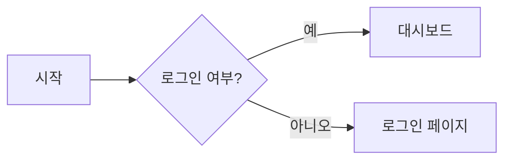

## 1. Mermaid의 필요성과 소개 ([공식문서](https://docs.mermaidchart.com/mermaid-oss/intro/index.html))

> 왜? Mermaid(인어) 지?\
> 텍스트만으로 복잡한 그래프나 다이어그램을 그리는 기능이 마치 바다의 신비로운 존재인 인어가 복잡한 바다 속을 쉽게 헤엄치는 것과 같다는 점에서 이러한 이름이 붙었다고 합니다.

### 특징

1. **텍스트 기반 다이어그램**: \
코드처럼 버전 관리 가능(Git 친화적)하며 협업과 변경 이력이 명확합니다.

2. **개발 워크플로우와 자연스러운 통합**: \
Markdown, GitHub, Notion, Confluence, VS Code 등과 손쉽게 연동됩니다.

3. **빠른 반복과 규격화**: \
복잡한 UI 없이 간결한 문법으로 빠르게 스케치하고 팀내 공유할 수 있습니다.

4. **자동화/문서생성 파이프라인**: \
스크립트나 CI에서 다이어그램을 생성·갱신하여 최신 문서 상태를 유지합니다.

5. **학습 비용이 낮음**: \
간단한 문법으로 플로우, 시퀀스, ERD 등 다양한 다이어그램을 한 번에 익힐 수 있습니다.

## 2. Flowchart([링크](https://docs.mermaidchart.com/mermaid-oss/syntax/flowchart.html)) 간단한 예제

Mermaid의 플로우차트는 `flowchart` 키워드로 시작하며 방향을 지정할 수 있습니다.

* **방향 옵션**

  * `TB/TD` :Top to bottom , Top-down
  * `BT` : Bottom to top
  * `RL` : Right to left
  * `LR` : Left to right
* **노드와 링크**: `A[텍스트] --> B(텍스트)` 형태로 연결합니다.
* **노드 모양 예시**:

  * 사각형: `A[사각형]`
  * 둥근 사각형: `B(둥근)`
  * 서브루틴: `C[[서브루틴]]`
  * 원형: `D((원))`
  * 다이아몬드(조건): `E{조건}`
  * 데이터베이스: `F[(DB)]`

### 예제

### 후기

* 문서정리할때 종종 사용하는 도구이며 LLM과 대화할때도 맥락전달시 유용하다
* 약간 아쉬운건 선의 길이나 도형의 위치를 자유롭게 조절하지 못하는 부분이 아쉬웠다\
  (내가 모르고 있거나 향후 기능이 확장될것 같다)
* https://www.mermaidchart.com 가입시 3페이지까지는 무료로 제공되고 툴바로 작성가능한 UI도 제공된다.
