## 시퀀스 다이어그램이란?

> 시퀀스 다이어그램은 시스템의 여러 요소(액터, 객체)들이 시간 순서에 따라 어떻게 메시지를 주고받는지 보여주는 UML 다이어그램의 일종입니다.

* API 설계 문서화: 클라이언트가 서버에 요청했을 때, 서버 내부의 여러 마이크로서비스가 어떤 순서로 동작하고 응답하는지 설명할 때.
* 프로세스 분석: "회원가입"이나 "결제" 같은 비즈니스 로직이 어떤 단계로 진행되고, 중간에 예외 처리는 어떻게 되는지 명확히 할 때.
* 코드 리뷰 & 인수인계: 새로 들어온 팀원에게 복잡한 레거시 시스템의 데이터 흐름을 가장 빠르게 이해시킬 때.

## 기본 문법

Mermaid에서 시퀀스 다이어그램을 작성하는 가장 기본적인 문법은 다음과 같습니다:

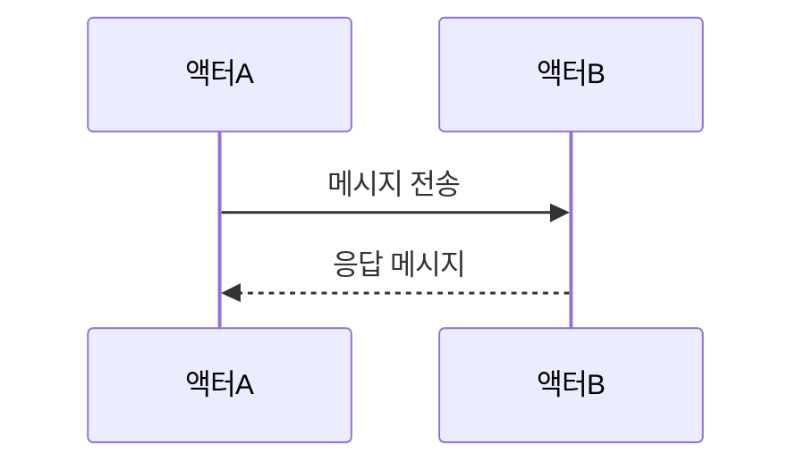

```md
sequenceDiagram
    participant A as 액터A
    participant B as 액터B
    A->>B: 메시지 전송
    B-->>A: 응답 메시지
```

## 액터와 파티시펀트

### 기본 파티시펀트 정의

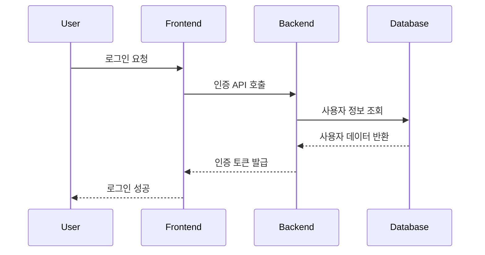

```md
sequenceDiagram
    participant User
    participant Frontend
    participant Backend
    participant Database
    
    User->>Frontend: 로그인 요청
    Frontend->>Backend: 인증 API 호출
    Backend->>Database: 사용자 정보 조회
    Database-->>Backend: 사용자 데이터 반환
    Backend-->>Frontend: 인증 토큰 발급
    Frontend-->>User: 로그인 성공
```

### 액터 심볼 사용

사각형 대신 사람 모양의 액터 심볼을 사용할 수 있습니다:

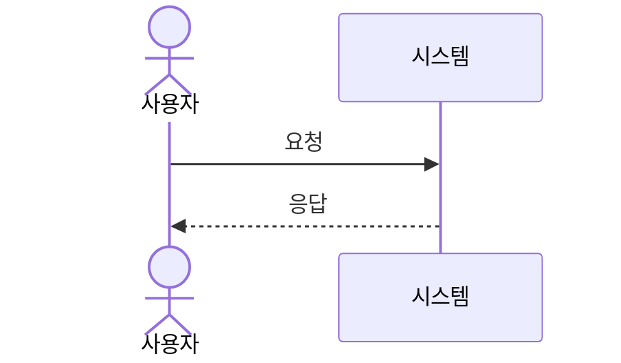

```md
sequenceDiagram
    actor User as 사용자
    participant System as 시스템
    
    User->>System: 요청
    System-->>User: 응답
```

### 그룹핑/박스

관련된 액터들을 그룹으로 묶을 수 있습니다:

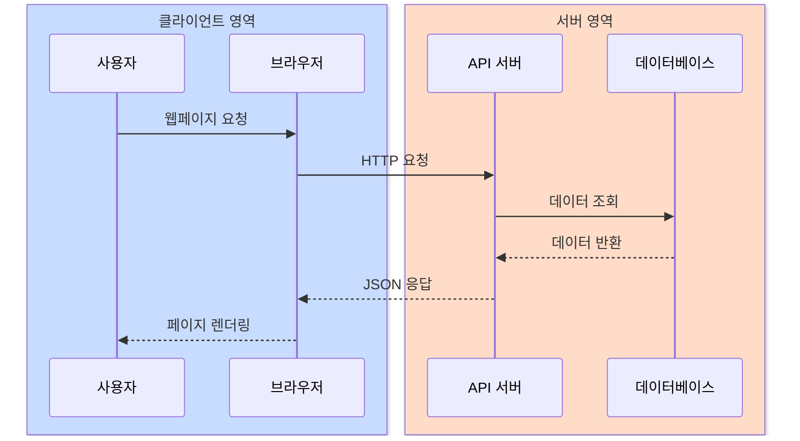

```md
sequenceDiagram
    box rgb(200, 220, 255) 클라이언트 영역
        participant User as 사용자
        participant Browser as 브라우저
    end
    
    box rgb(255, 220, 200) 서버 영역
        participant API as API 서버
        participant DB as 데이터베이스
    end
    
    User->>Browser: 웹페이지 요청
    Browser->>API: HTTP 요청
    API->>DB: 데이터 조회
    DB-->>API: 데이터 반환
    API-->>Browser: JSON 응답
    Browser-->>User: 페이지 렌더링
```

## 메시지와 화살표

Mermaid는 다양한 메시지 화살표 타입을 지원합니다:

| 화살표      | 설명          | 예제      |
| -------- | ----------- | ------- |
| `->`     | 실선 (화살표 없음) | 동기 호출   |
| `-->`    | 점선 (화살표 없음) | 비동기 호출  |
| `->>`    | 실선 (화살표 있음) | 응답/반환   |
| `-->>`   | 점선 (화살표 있음) | 비동기 응답  |
| `<<->>`  | 양방향 실선      | 양방향 통신  |
| `<<-->>` | 양방향 점선      | 양방향 비동기 |
| `-x`     | 실선 (X 표시)   | 실패/에러   |
| `--x`    | 점선 (X 표시)   | 비동기 실패  |
| `-)`     | 실선 (열린 화살표) | 비동기 호출  |
| `--)`    | 점선 (열린 화살표) | 비동기 응답  |

### 메시지 타입 예제

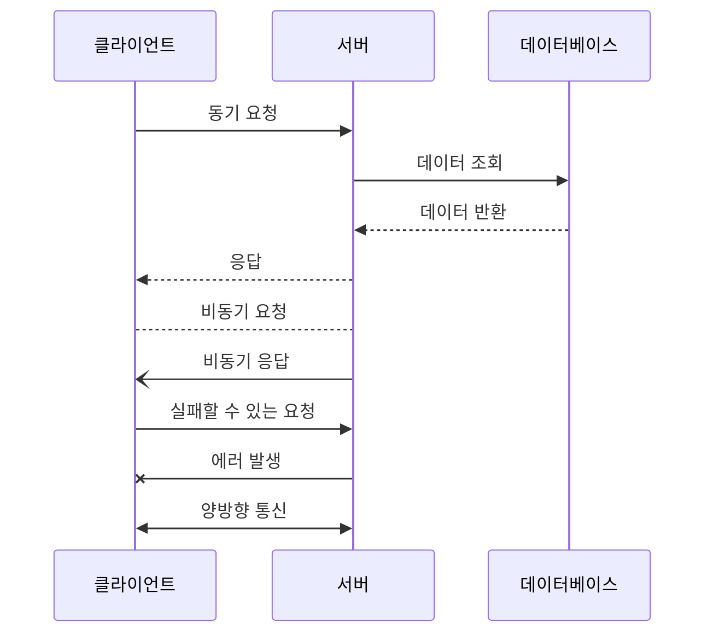

```md
sequenceDiagram
    participant Client as 클라이언트
    participant Server as 서버
    participant DB as 데이터베이스
    
    Client->>Server: 동기 요청
    Server->>DB: 데이터 조회
    DB-->>Server: 데이터 반환
    Server-->>Client: 응답
    
    Client-->Server: 비동기 요청
    Server-)Client: 비동기 응답
    
    Client->>Server: 실패할 수 있는 요청
    Server-xClient: 에러 발생
    
    Client<<->>Server: 양방향 통신
```

## 활성화와 비활성화

액터의 활성화 상태를 표현할 수 있습니다:

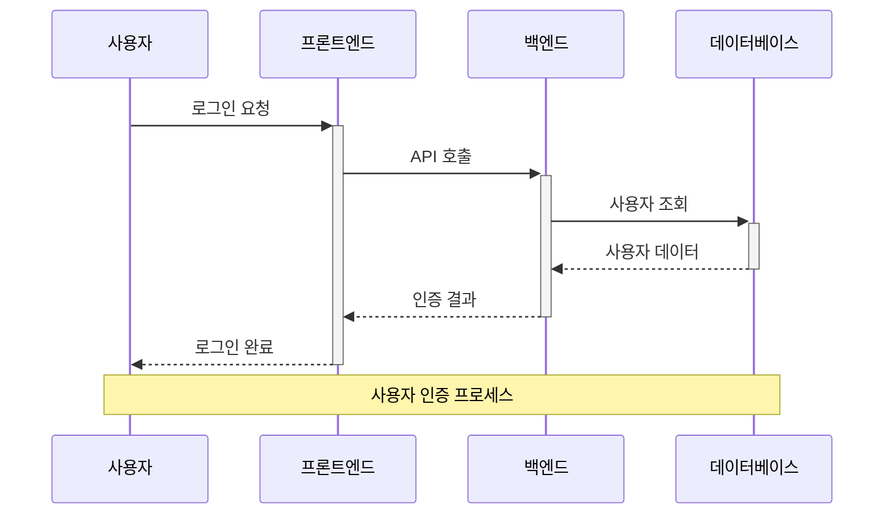

```md
sequenceDiagram
    participant User as 사용자
    participant Frontend as 프론트엔드
    participant Backend as 백엔드
    participant DB as 데이터베이스
    
    User->>+Frontend: 로그인 요청
    Frontend->>+Backend: API 호출
    Backend->>+DB: 사용자 조회
    DB-->>-Backend: 사용자 데이터
    Backend-->>-Frontend: 인증 결과
    Frontend-->>-User: 로그인 완료
    
    Note over User, DB: 사용자 인증 프로세스
```

## 고급 기능

### 루프 (Loops)

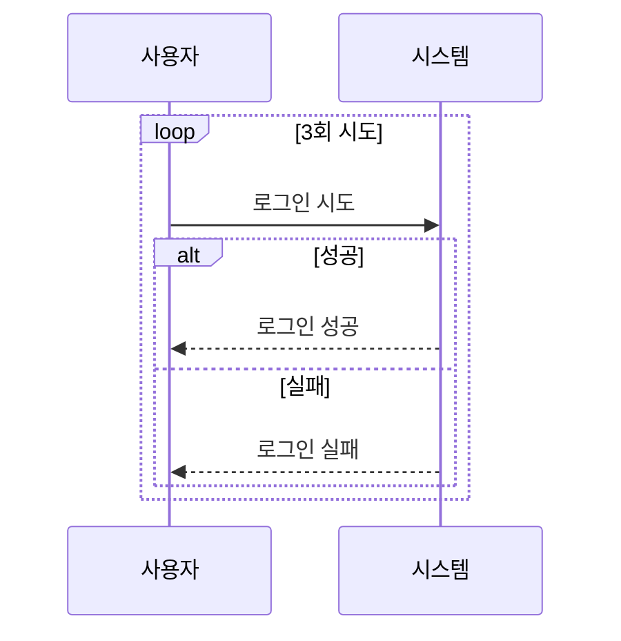

```md
sequenceDiagram
    participant User as 사용자
    participant System as 시스템
    
    loop 3회 시도
        User->>System: 로그인 시도
        alt 성공
            System-->>User: 로그인 성공
        else 실패
            System-->>User: 로그인 실패
        end
    end
```

### 조건문 (Alt/Opt)

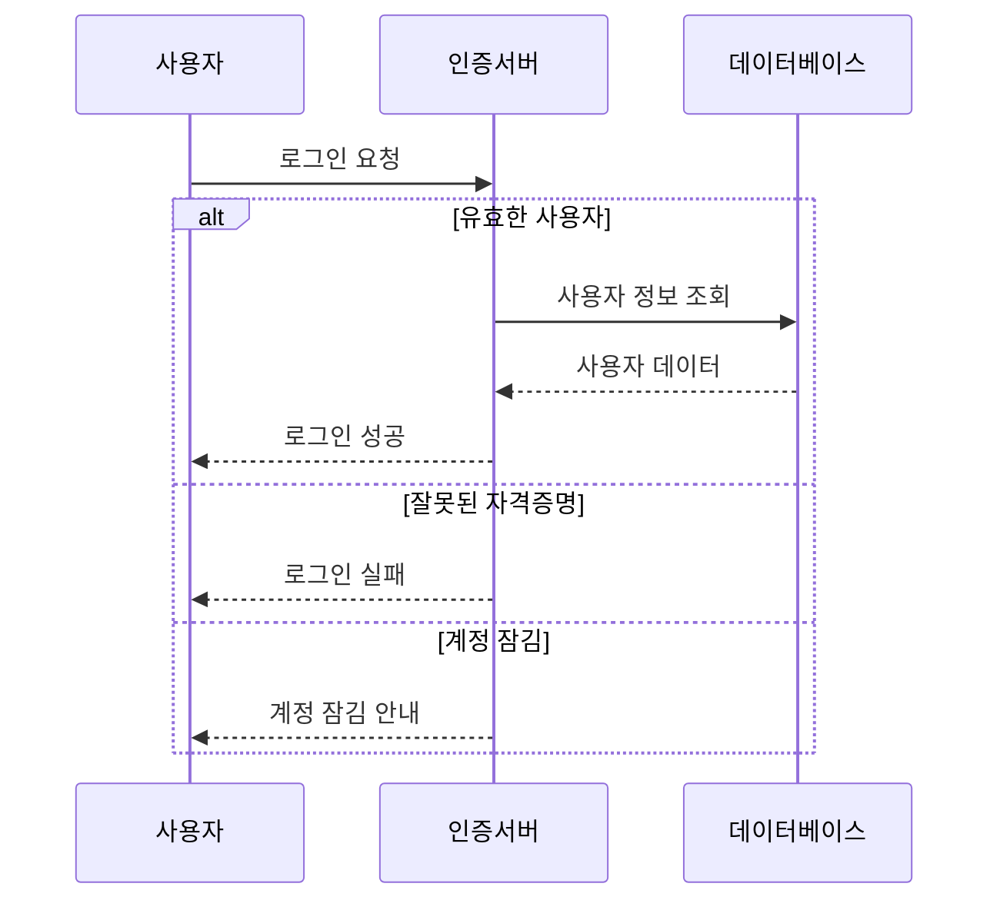

```md
sequenceDiagram
    participant User as 사용자
    participant Auth as 인증서버
    participant DB as 데이터베이스
    
    User->>Auth: 로그인 요청
    
    alt 유효한 사용자
        Auth->>DB: 사용자 정보 조회
        DB-->>Auth: 사용자 데이터
        Auth-->>User: 로그인 성공
    else 잘못된 자격증명
        Auth-->>User: 로그인 실패
    else 계정 잠김
        Auth-->>User: 계정 잠김 안내
    end
```

### 병렬 처리 (Parallel)

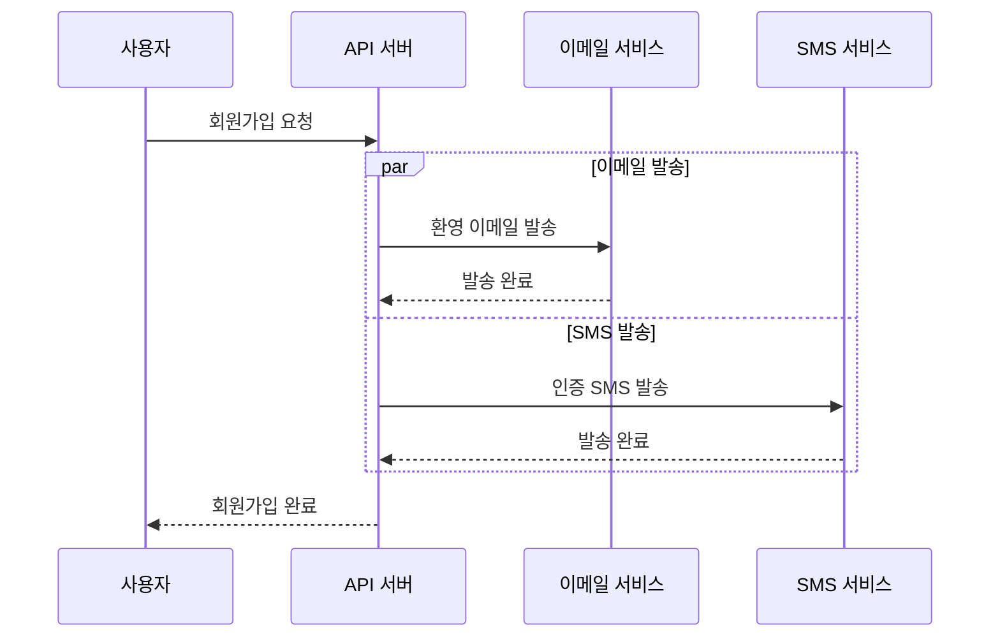

```md
sequenceDiagram
    participant User as 사용자
    participant API as API 서버
    participant Email as 이메일 서비스
    participant SMS as SMS 서비스
    
    User->>API: 회원가입 요청
    
    par 이메일 발송
        API->>Email: 환영 이메일 발송
        Email-->>API: 발송 완료
    and SMS 발송
        API->>SMS: 인증 SMS 발송
        SMS-->>API: 발송 완료
    end
    
    API-->>User: 회원가입 완료
```

### 크리티컬 섹션

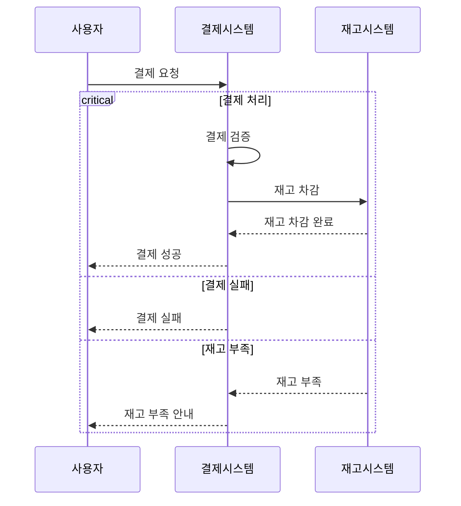

```md
sequenceDiagram
    participant User as 사용자
    participant Payment as 결제시스템
    participant Inventory as 재고시스템
    
    User->>Payment: 결제 요청
    
    critical 결제 처리
        Payment->>Payment: 결제 검증
        Payment->>Inventory: 재고 차감
        Inventory-->>Payment: 재고 차감 완료
        Payment-->>User: 결제 성공
    option 결제 실패
        Payment-->>User: 결제 실패
    option 재고 부족
        Inventory-->>Payment: 재고 부족
        Payment-->>User: 재고 부족 안내
    end
```

### 브레이크 (예외 처리)

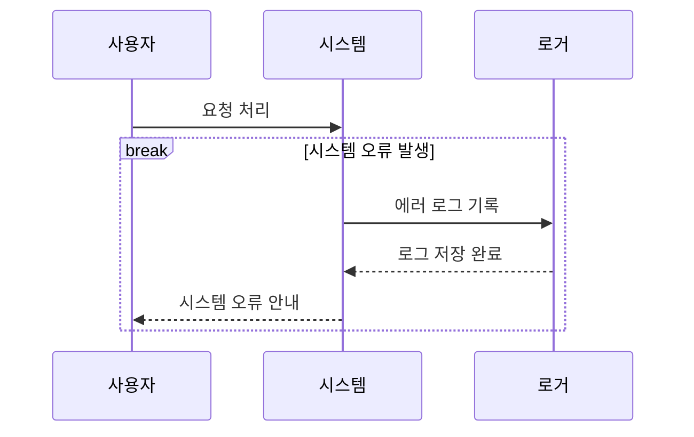

```md
sequenceDiagram
    participant User as 사용자
    participant System as 시스템
    participant Logger as 로거
    
    User->>System: 요청 처리
    
    break 시스템 오류 발생
        System->>Logger: 에러 로그 기록
        Logger-->>System: 로그 저장 완료
        System-->>User: 시스템 오류 안내
    end
```

### 배경 하이라이팅

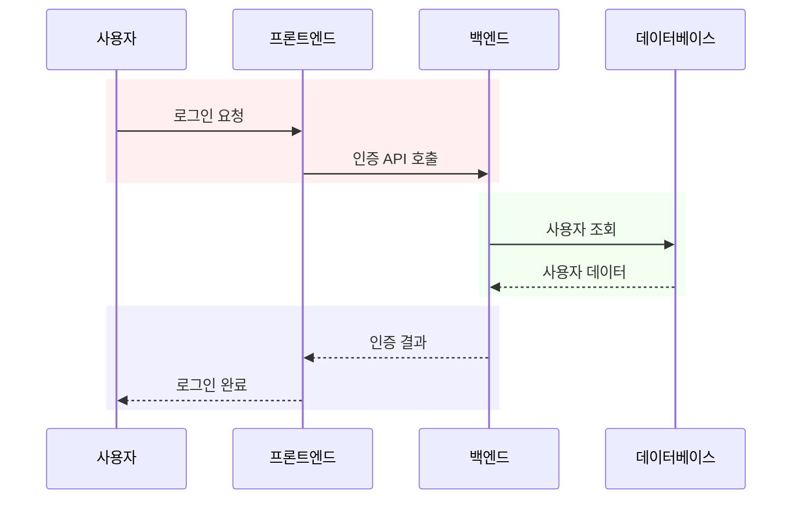

```md
sequenceDiagram
    participant User as 사용자
    participant Frontend as 프론트엔드
    participant Backend as 백엔드
    participant DB as 데이터베이스
    
    rect rgb(255, 240, 240)
        User->>Frontend: 로그인 요청
        Frontend->>Backend: 인증 API 호출
    end
    
    rect rgb(240, 255, 240)
        Backend->>DB: 사용자 조회
        DB-->>Backend: 사용자 데이터
    end
    
    rect rgb(240, 240, 255)
        Backend-->>Frontend: 인증 결과
        Frontend-->>User: 로그인 완료
    end
```

## 실제 사용 예제

### 🛒 주문 프로세스 다이어그램(온라인 쇼핑몰)

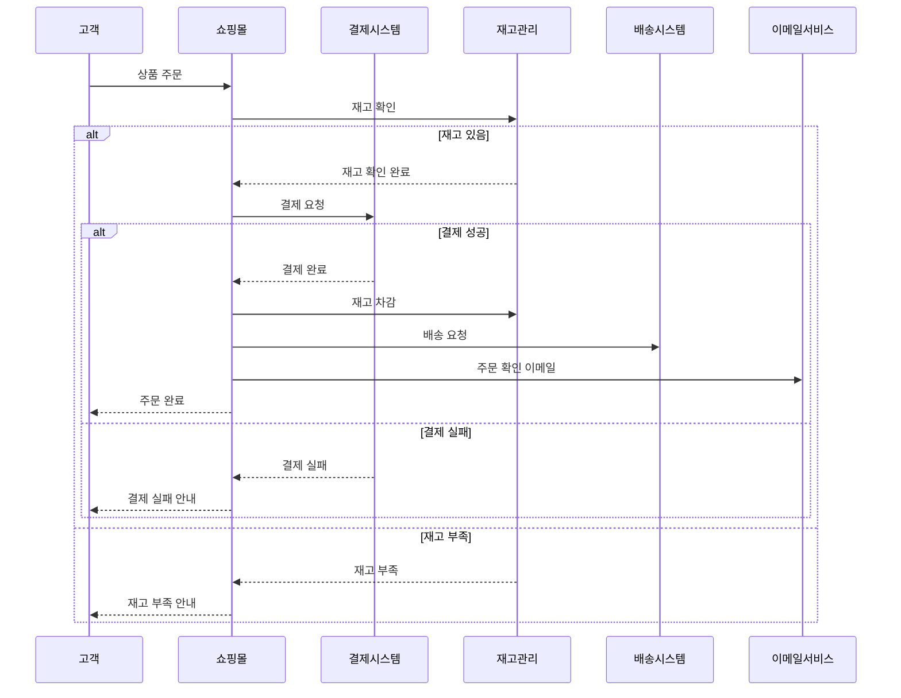

```md
sequenceDiagram
    participant Customer as 고객
    participant Frontend as 쇼핑몰
    participant Payment as 결제시스템
    participant Inventory as 재고관리
    participant Shipping as 배송시스템
    participant Email as 이메일서비스
    
    Customer->>Frontend: 상품 주문
    Frontend->>Inventory: 재고 확인
    
    alt 재고 있음
        Inventory-->>Frontend: 재고 확인 완료
        Frontend->>Payment: 결제 요청
        
        alt 결제 성공
            Payment-->>Frontend: 결제 완료
            Frontend->>Inventory: 재고 차감
            Frontend->>Shipping: 배송 요청
            Frontend->>Email: 주문 확인 이메일
            Frontend-->>Customer: 주문 완료
        else 결제 실패
            Payment-->>Frontend: 결제 실패
            Frontend-->>Customer: 결제 실패 안내
        end
    else 재고 부족
        Inventory-->>Frontend: 재고 부족
        Frontend-->>Customer: 재고 부족 안내
    end
```

## 마무리

> Mermaid 시퀀스 다이어그램은 단순히 그림을 그리는 도구가 아니라, 복잡한 시스템의 **'설명서'**를 코드로 만드는 행위입니다. 저도 처음에는 익숙하지 않아서 잠깐 헤맸지만, 조금씩 작성해 보면 금방 익숙해 질것 같습니다.

- - -

**참고 자료:**

* [Mermaid 공식 문서 - Sequence Diagram](https://docs.mermaidchart.com/mermaid-oss/syntax/sequenceDiagram.html)
