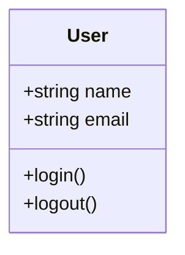
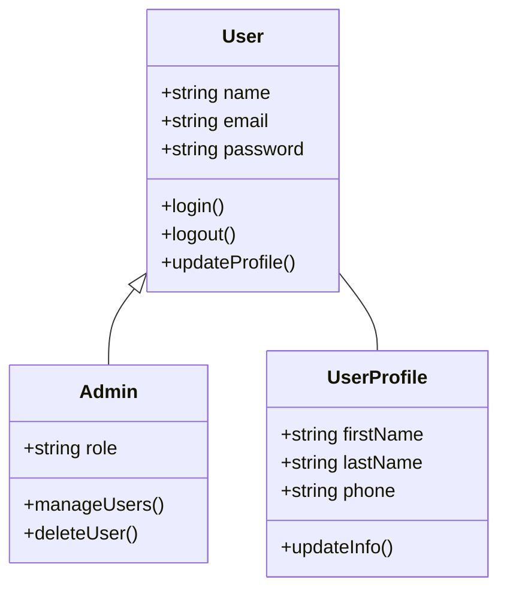
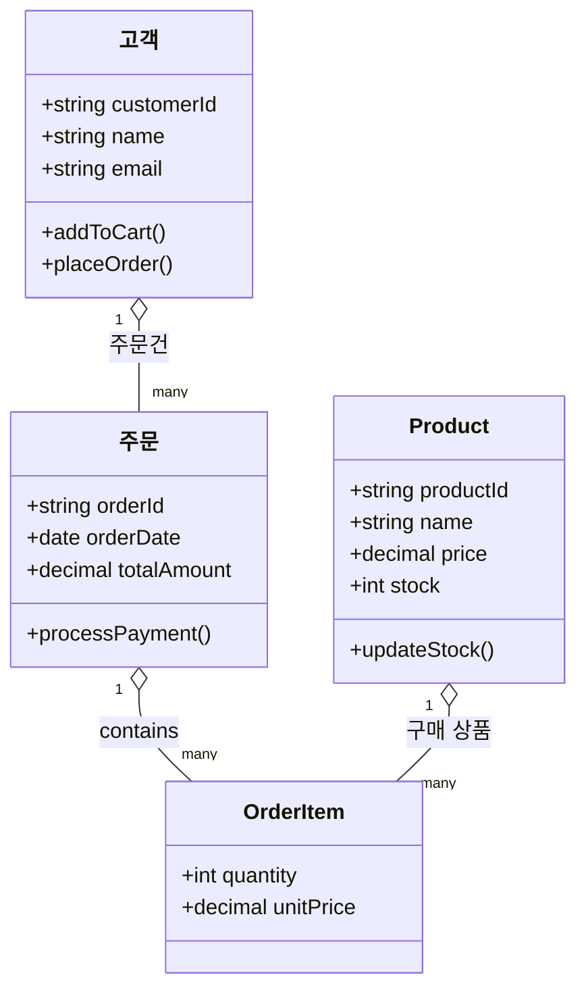
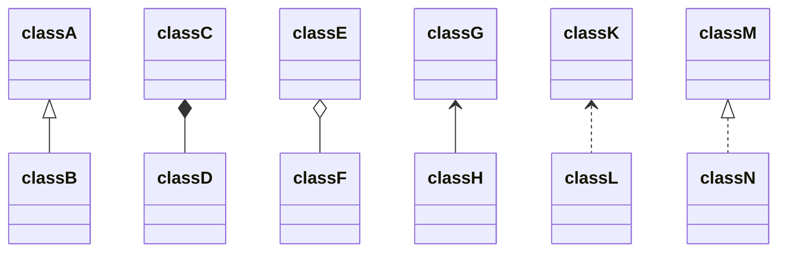
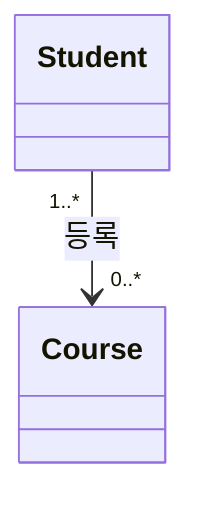

## 1. 클래스 다이어그램이란?

클래스 다이어그램은 시스템의 클래스, 속성, 메서드, 그리고 클래스 간의 관계를 보여주는 정적 구조 다이어그램입니다. 소프트웨어 설계 단계에서 시스템의 전체적인 구조를 파악하고, 개발자 간의 소통을 원활하게 하는 데 도움을 줍니다.

## 2. 기본 문법

클래스 다이어그램은 `classDiagram` 키워드로 시작하며, 클래스는 다음과 같이 정의할 수 있습니다:



```md
classDiagram
  class User {
    +string name
    +string email
    +login()
    +logout()
  }
```

* `+` : public (공개)
* `-` : private (비공개)  
* `#` : protected (보호)
* `~` : package/internal (패키지 내부)

### 예제 1: 간단한 사용자 관리 시스템



```md
classDiagram
  class User {
    +string name
    +string email
    +string password
    +login()
    +logout()
    +updateProfile()
  }
  
  class Admin {
    +string role
    +manageUsers()
    +deleteUser()
  }
  
  class UserProfile {
    +string firstName
    +string lastName
    +string phone
    +updateInfo()
  }
  
  User <|-- Admin
  User -- UserProfile
```

이 예제에서는:

* `User` 클래스가 기본 사용자 정보를 담고 있습니다
* `Admin` 클래스가 `User`를 상속받아 관리자 기능을 추가합니다
* `User`와 `UserProfile`은 1:1 관계로 연결되어 있습니다

### 예제 2: 온라인 쇼핑몰 시스템



이 예제에서는:

* 고객이 여러 주문을 할 수 있습니다.
* 주문은 여러 주문 항목을 포함할 수 있습니다.
* 상품은 여러 주문 항목에 포함될 수 있습니다.

## 3. 클래스 간 관계 표기법

클래스 다이어그램에서 가장 중요한 부분 중 하나는 클래스 간의 관계를 표현하는 것입니다. 주요 관계들은 다음과 같이 표기합니다:

| 관계  | 표기법     | 설명            | 예시                     |
| --- | ------- | ------------- | ---------------------- |
| 상속  | `<\|--` | 부모-자식 관계      | `Animal <\|-- Dog`     |
| 구현  | `..\|>` | 인터페이스 구현      | `Flying ..\|> Bird`    |
| 연관  | `-->`   | 일반적인 연결       | `Customer --> Order`   |
| 집합  | `o--`   | 부분-전체 (약한 소유) | `Company o-- Employee` |
| 합성  | `*--`   | 부분-전체 (강한 소유) | `Car *-- Engine`       |
| 의존  | `..>`   | 사용 관계         | `Order ..> Payment`    |
| 살채화  | `<|..>` | 구현 관계        | `Payment <!.. CreditCardPayment` |



### 관계의 방향성

관계는 양방향으로도 표현할 수 있습니다:



이 경우 학생은 1명 이상이 한 과목에 등록할 수 있고, 한 과목은 0명 이상의 학생이 등록할 수 있음을 나타냅니다.

## 4. 마무리

Mermaid 클래스 다이어그램을 사용하면 복잡한 객체지향 시스템을 직관적으로 표현할 수 있습니다.
더 자세한 문법과 고급 기능들은 [공식 문서](https://docs.mermaidchart.com/mermaid-oss/syntax/classDiagram.html)에서 확인하실 수 있습니다.
