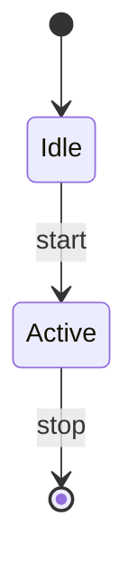
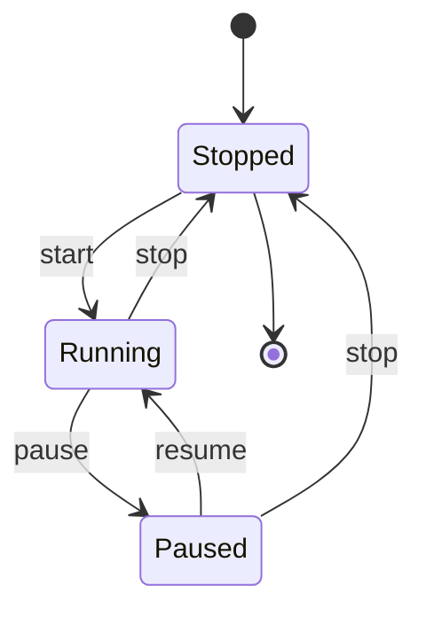
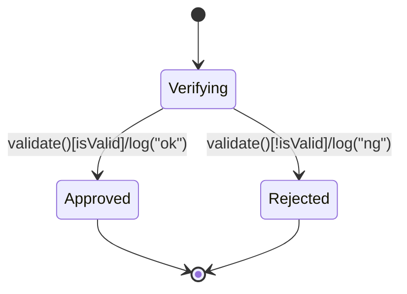
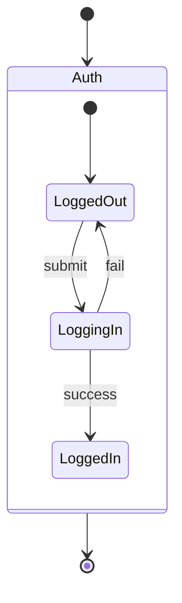
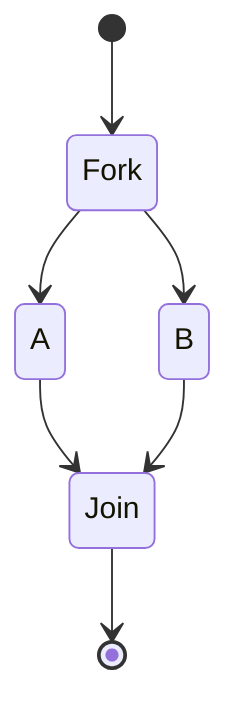
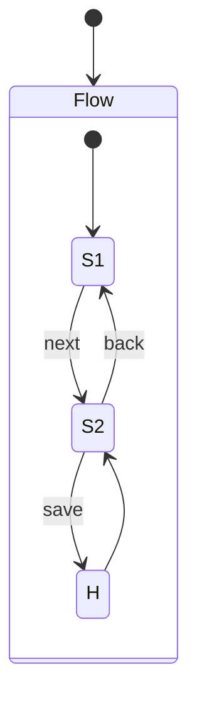
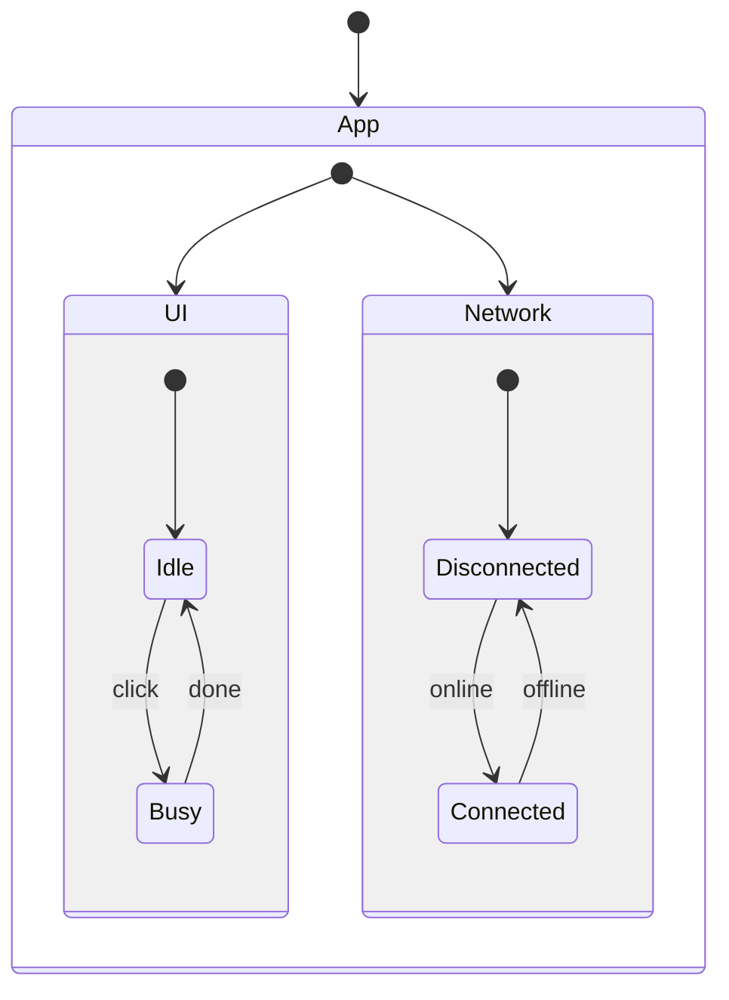
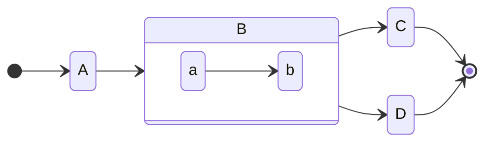

# 상태 기반 흐름 설계

> 상태 다이어그램(State Diagram)은 객체나 시스템이 가질 수 있는 상태들과 상태 간 전이를 시간의 흐름 속에서 표현하는 도구입니다. Mermaid를 이용하면 텍스트로 상태 다이어그램을 선언적으로 기술할 수 있어, 요구사항 분석과 설계 단계에서 이해관계를 명확히 하고 구현 시 참조하기 좋습니다.

## 상태 다이어그램이란?

상태 다이어그램은 특정 대상(객체, 화면, 프로세스 등)이 어떤 상태들을 가지며, 이벤트(또는 조건)에 의해 어떤 전이(transition)가 발생하는지 시각화합니다. 시작과 종료, 가드 조건(조건부 전이), 복합 상태, 동시성 등을 표현할 수 있습니다.

## 기본 문법

Mermaid 상태 다이어그램은 `stateDiagram` 또는 `stateDiagram-v2` 키워드로 시작합니다.



```md
stateDiagram-v2
  [*] --> Idle
  Idle --> Active: start
  Active --> [*]: stop
```

* `[*]`는 시작 혹은 종료 지점을 의미합니다.
* `A --> B: eventOrCondition` 형태로 전이와 라벨(이벤트/조건/액션)을 표기합니다.

## 예제 1: 타이머 상태 머신



```md
stateDiagram-v2
  [*] --> Stopped
  Stopped --> Running: start
  Running --> Paused: pause
  Paused --> Running: resume
  Running --> Stopped: stop
  Paused --> Stopped: stop
  Stopped --> [*]
```

이 예제에서는 `start`, `pause`, `resume`, `stop` 이벤트에 따라 타이머의 상태가 전이됩니다.

## 예제 2: 가드 조건과 액션

조건(guard)을 사용해 분기할 수 있습니다. 라벨에 조건을 대괄호로 명시하고, `/` 뒤에 액션(효과)을 적을 수 있습니다.



```md
stateDiagram-v2
  [*] --> Verifying
  Verifying --> Approved: validate()[isValid]/log("ok")
  Verifying --> Rejected: validate()[!isValid]/log("ng")
  Approved --> [*]
  Rejected --> [*]
```

* `validate()`는 트리거되는 이벤트/동작 이름으로, `[isValid]`는 가드, `/log("ok")`는 전이 시 수행하는 액션의 예시입니다.
* 위와같은 다이어그램을 활용해 보지 않아서 생소하지만 아래의 코드를 표현한 내용으로 이해하시면 될것 같습니다.
```javascript
// 상태: Verifying
function onValidate(context) {
  if (context.isValid) {      // [isValid]  ← 가드
    log("ok");                // /log("ok") ← 액션(전이가 선택된 경우 실행)
    return "Approved";        // 전이 대상 상태
  } else {                    // [!isValid]
    log("ng");                // /log("ng")
    return "Rejected";
  }
}
```

## 복합 상태(서브스테이트)

상태 내부에 하위 상태를 정의해 복잡도를 캡슐화할 수 있습니다.



```md
stateDiagram-v2
  [*] --> Auth
  state Auth {
    [*] --> LoggedOut
    LoggedOut --> LoggingIn: submit
    LoggingIn --> LoggedIn: success
    LoggingIn --> LoggedOut: fail
  }
  Auth --> [*]
```

* `state <Name> { ... }` 블록 내부에 하위 상태 머신을 정의합니다.

## Fork/Join(병렬 흐름)

여러 하위 흐름을 병렬로 진행하거나 동기화할 수 있습니다.



```md
stateDiagram-v2
  [*] --> Fork
  Fork --> A
  Fork --> B
  A --> Join
  B --> Join
  Join --> [*]
```

## History(이전 하위 상태 복원)

복합 상태에서 마지막 하위 상태를 저장하고 복원할 수 있는 히스토리 노드를 지원합니다.



```md
stateDiagram-v2
  [*] --> Flow
  state Flow {
    [*] --> S1
    S1 --> S2: next
    S2 --> S1: back
    S2 --> H: save
    H --> S2
  }
```

* `H`는 shallow history(얕은 히스토리)의 예시입니다. 복합 상태 재진입 시 마지막 하위 상태로 복원됩니다.

## 동시성(Concurrent Regions)

한 상태를 여러 동시 구역으로 나눠 병렬 상태를 표현할 수 있습니다.



```md
stateDiagram-v2
  [*] --> App
  state App {
    [*] --> UI
    [*] --> Network

    state UI {
      [*] --> Idle
      Idle --> Busy: click
      Busy --> Idle: done
    }

    state Network {
      [*] --> Disconnected
      Disconnected --> Connected: online
      Connected --> Disconnected: offline
    }
  }
```

## 방향 명령문(LR)



```md
stateDiagram-v2
    direction LR
    [*] --> A
    A --> B
    B --> C
    state B {
      direction LR
      a --> b
    }
    B --> D
    C --> [*]
    D --> [*]
```

## 모델링 팁

* 이벤트/조건/액션을 라벨로 일관되게 표기합니다. `event[guard]/action` 형식을 권장합니다.
* 상태는 의미적으로 구분 가능한 단계만 남기고, 전이는 외부에서 관찰 가능한 사건만 남깁니다.
* 복합 상태를 사용해 세부 절차를 캡슐화하고, 상위 상태에서는 비즈니스적으로 중요한 흐름만 보이게 합니다.
* 병렬 흐름이 필요한 경우에만 Fork/Join을 사용하여 복잡도를 통제합니다.
