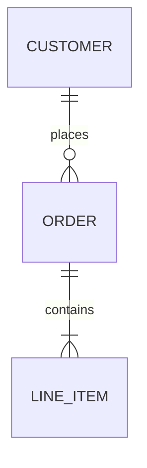
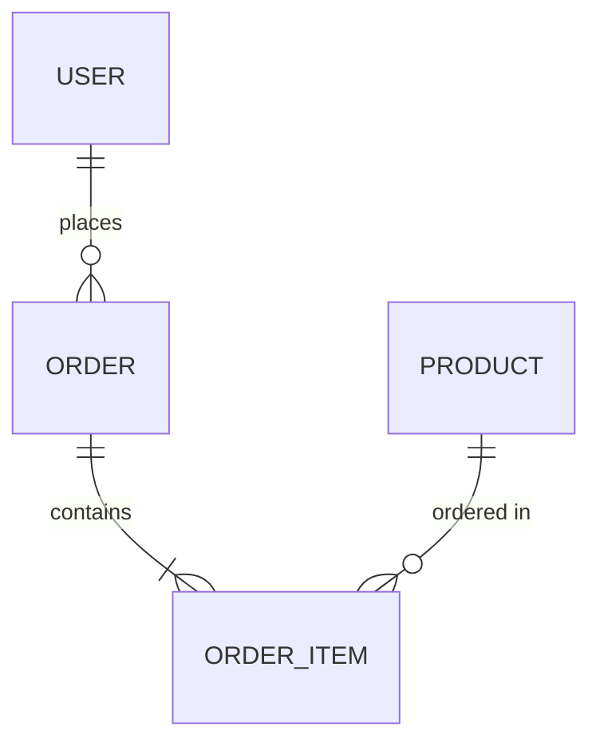
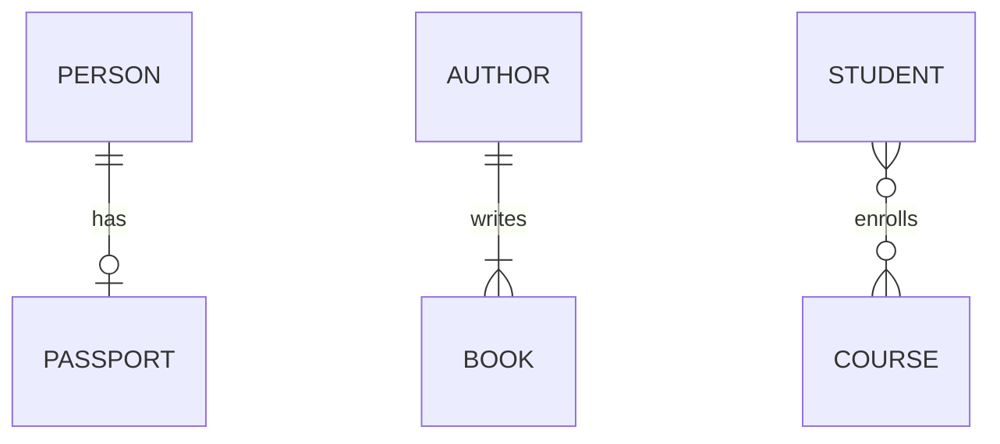
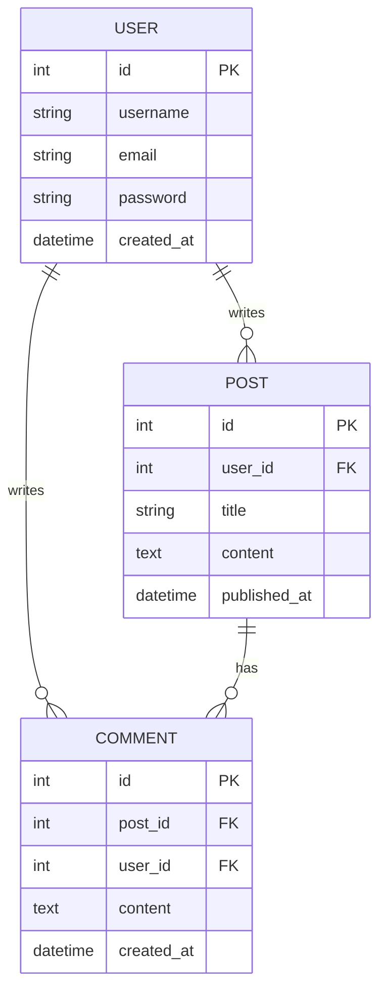
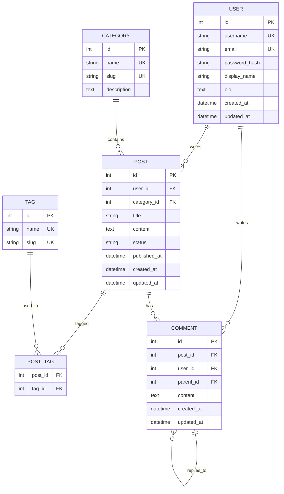
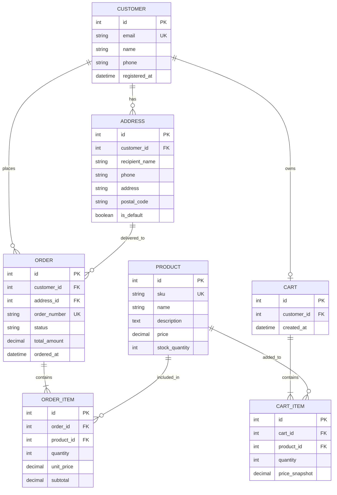
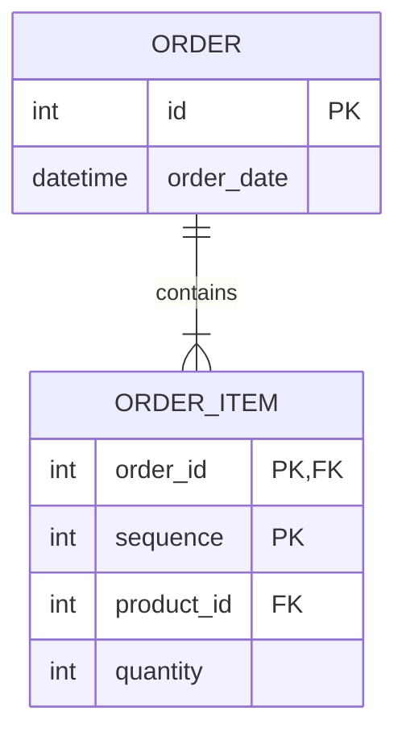
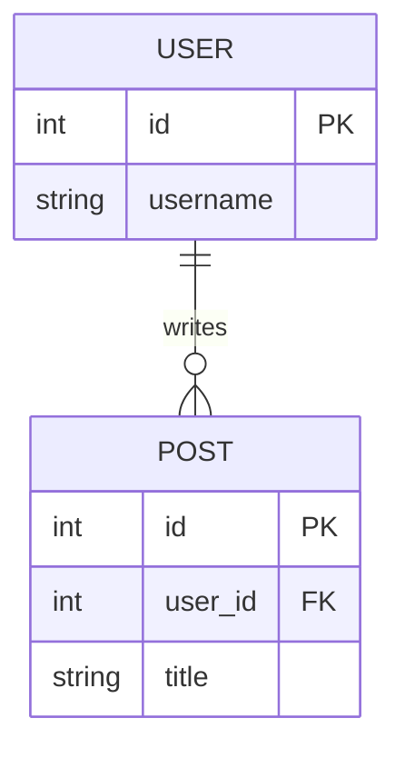

# 데이터베이스 설계 시각화

ERD는 데이터베이스의 구조를 시각적으로 표현하는 다이어그램입니다. 엔티티(Entity), 속성(Attribute), 그리고 엔티티 간의 관계(Relationship)를 나타내어, 데이터베이스 설계 단계에서 팀원들과의 소통을 원활하게 하고 구현 시 참조하기 좋습니다.

주요 사용 사례:

* 데이터베이스 스키마 설계 및 문서화
* 테이블 간 관계 파악
* 정규화 과정 시각화
* 개발자와 기획자 간의 의사소통 도구

## 기본 문법

Mermaid ERD는 `erDiagram` 키워드로 시작합니다.



```md
erDiagram
  CUSTOMER ||--o{ ORDER : places
  ORDER ||--|{ LINE_ITEM : contains
```

* `CUSTOMER`, `ORDER`, `LINE_ITEM`은 엔티티(테이블)를 나타냅니다.
* `||--o{`와 같은 기호는 관계의 카디널리티를 표현합니다.
* `: places`, `: contains`는 관계에 대한 설명입니다.

## 예제 1: 간단한 사용자-주문 시스템



```md
erDiagram
  USER ||--o{ ORDER : places
  ORDER ||--|{ ORDER_ITEM : contains
  PRODUCT ||--o{ ORDER_ITEM : "ordered in"
```

이 예제에서는:

* 한 명의 사용자(USER)는 여러 개의 주문(ORDER)을 할 수 있습니다 (1:N 관계)
* 한 개의 주문(ORDER)은 여러 개의 주문 항목(ORDER_ITEM)을 포함합니다 (1:N 관계)
* 한 개의 상품(PRODUCT)은 여러 주문 항목에 포함될 수 있습니다 (1:N 관계)

## 카디널리티 표기법

Mermaid ERD는 크로우즈 풋(Crow's Foot) 표기법을 사용합니다.

| 기호   | 의미      | 설명           |
| ---- | ------- | ------------ |
| `|o` | 0 또는 1개 | Zero or One  |
| `||` | 정확히 1개  | Exactly One  |
| `}o` | 0개 이상   | Zero or More |
| `}|` | 1개 이상   | One or More  |

### 관계 조합 예제



```md
erDiagram
  PERSON ||--o| PASSPORT : has
  AUTHOR ||--|{ BOOK : writes
  STUDENT }o--o{ COURSE : enrolls
```

* `PERSON ||--o| PASSPORT`: 한 사람은 여권을 0개 또는 1개 가질 수 있습니다 (1:0..1)
* `AUTHOR ||--|{ BOOK`: 한 저자는 최소 1개 이상의 책을 씁니다 (1:N)
* `STUDENT }o--o{ COURSE`: 학생과 강의는 다대다(M:N) 관계입니다

## 예제 2: 속성 정의하기

엔티티에 속성을 추가하여 더 상세한 정보를 표현할 수 있습니다.



```md
erDiagram
  USER {
    int id PK
    string username
    string email
    string password
    datetime created_at
  }
  
  POST {
    int id PK
    int user_id FK
    string title
    text content
    datetime published_at
  }
  
  COMMENT {
    int id PK
    int post_id FK
    int user_id FK
    text content
    datetime created_at
  }
  
  USER ||--o{ POST : writes
  USER ||--o{ COMMENT : writes
  POST ||--o{ COMMENT : has
```

속성 표기 방법:

* `int id PK`: 정수형 id 필드, 기본키(Primary Key)
* `int user_id FK`: 정수형 user_id 필드, 외래키(Foreign Key)
* `string`, `text`, `datetime`: 데이터 타입
* 각 속성은 엔티티 블록 `{ }` 내부에 정의됩니다

## 예제 3: 블로그 시스템

실전 예제로 블로그 시스템의 ERD를 설계해보겠습니다.



```md
erDiagram
  USER {
    int id PK
    string username UK
    string email UK
    string password_hash
    string display_name
    text bio
    datetime created_at
    datetime updated_at
  }
  
  CATEGORY {
    int id PK
    string name UK
    string slug UK
    text description
  }
  
  POST {
    int id PK
    int user_id FK
    int category_id FK
    string title
    text content
    string status
    datetime published_at
    datetime created_at
    datetime updated_at
  }
  
  TAG {
    int id PK
    string name UK
    string slug UK
  }
  
  POST_TAG {
    int post_id FK
    int tag_id FK
  }
  
  COMMENT {
    int id PK
    int post_id FK
    int user_id FK
    int parent_id FK
    text content
    datetime created_at
    datetime updated_at
  }
  
  USER ||--o{ POST : writes
  USER ||--o{ COMMENT : writes
  CATEGORY ||--o{ POST : contains
  POST ||--o{ COMMENT : has
  POST ||--o{ POST_TAG : tagged
  TAG ||--o{ POST_TAG : used_in
  COMMENT ||--o{ COMMENT : replies_to
```

이 ERD는 다음과 같은 기능을 지원합니다:

* 사용자가 여러 게시글과 댓글을 작성할 수 있습니다
* 게시글은 하나의 카테고리에 속하며 여러 태그를 가질 수 있습니다
* 댓글은 대댓글(계층 구조)을 지원합니다
* `UK`는 Unique Key를 의미하여 중복을 방지합니다

## 예제 4: 온라인 쇼핑몰



```md
erDiagram
  CUSTOMER {
    int id PK
    string email UK
    string name
    string phone
    datetime registered_at
  }
  
  ADDRESS {
    int id PK
    int customer_id FK
    string recipient_name
    string phone
    string address
    string postal_code
    boolean is_default
  }
  
  PRODUCT {
    int id PK
    string sku UK
    string name
    text description
    decimal price
    int stock_quantity
  }
  
  CART {
    int id PK
    int customer_id FK
    datetime created_at
  }
  
  CART_ITEM {
    int id PK
    int cart_id FK
    int product_id FK
    int quantity
    decimal price_snapshot
  }
  
  ORDER {
    int id PK
    int customer_id FK
    int address_id FK
    string order_number UK
    string status
    decimal total_amount
    datetime ordered_at
  }
  
  ORDER_ITEM {
    int id PK
    int order_id FK
    int product_id FK
    int quantity
    decimal unit_price
    decimal subtotal
  }
  
  CUSTOMER ||--o{ ADDRESS : has
  CUSTOMER ||--o| CART : owns
  CART ||--|{ CART_ITEM : contains
  PRODUCT ||--o{ CART_ITEM : added_to
  CUSTOMER ||--o{ ORDER : places
  ORDER ||--|{ ORDER_ITEM : contains
  PRODUCT ||--o{ ORDER_ITEM : included_in
  ADDRESS ||--o{ ORDER : delivered_to
```

쇼핑몰 ERD의 주요 특징:

* 고객은 여러 배송지를 가질 수 있으며, 그 중 하나를 기본 배송지로 설정할 수 있습니다
* 장바구니는 여러 상품을 담을 수 있으며, 각 상품의 수량을 관리합니다
* 주문 시 상품의 가격을 스냅샷으로 저장하여 가격 변동에 영향받지 않습니다

## 모델링 팁

### 1. 명확한 명명 규칙

* 엔티티명은 대문자와 언더스코어를 사용합니다 (예: `USER`, `ORDER_ITEM`)
* 속성명은 소문자와 언더스코어를 사용합니다 (예: `user_id`, `created_at`)
* 관계 설명은 동사를 사용하여 명확하게 표현합니다 (예: `places`, `contains`)

### 2. 정규화 고려

* 중복 데이터를 제거하고 데이터 무결성을 유지합니다
* 다대다(M:N) 관계는 중간 테이블(junction table)로 분리합니다
* 자주 함께 조회되는 데이터는 적절히 비정규화를 고려합니다

### 3. 키 설계

* 모든 엔티티는 기본키(PK)를 가져야 합니다
* 외래키(FK)를 명시하여 관계를 명확히 합니다
* 비즈니스 로직상 유일해야 하는 값은 유니크 키(UK)로 표시합니다

### 4. 타입 선택

* 숫자는 `int`, `bigint`, `decimal` 등으로 구분합니다
* 텍스트는 길이에 따라 `string`, `text` 등으로 구분합니다
* 날짜/시간은 `date`, `datetime`, `timestamp` 등을 사용합니다

### 5. 감사(Audit) 필드

* 대부분의 엔티티에 `created_at`, `updated_at`을 추가합니다
* 필요한 경우 `created_by`, `updated_by`를 추가하여 변경 이력을 추적합니다

## 관계 식별 예제

### 식별 관계 (Identifying Relationship)

부모 엔티티의 기본키가 자식 엔티티의 기본키의 일부가 되는 관계입니다.



```md
erDiagram
  ORDER {
    int id PK
    datetime order_date
  }
  
  ORDER_ITEM {
    int order_id PK,FK
    int sequence PK
    int product_id FK
    int quantity
  }
  
  ORDER ||--|{ ORDER_ITEM : contains
```

### 비식별 관계 (Non-Identifying Relationship)

부모 엔티티의 기본키가 자식 엔티티의 일반 속성(외래키)이 되는 관계입니다.



```md
erDiagram
  USER {
    int id PK
    string username
  }
  
  POST {
    int id PK
    int user_id FK
    string title
  }
  
  USER ||--o{ POST : writes
```

## 마무리

ERD 작성 시 다음을 기억하세요:

* 명확한 엔티티와 관계 정의
* 적절한 카디널리티 표현
* 정규화를 고려한 설계
* 실무에서 필요한 감사 필드 포함
* 공식 문서: <https://docs.mermaidchart.com/mermaid-oss/syntax/entityRelationshipDiagram.html>
