## 데이터 비율 시각화

파이 차트는 전체에서 각 항목이 차지하는 비율을 한눈에 보여주는 원형 통계 그래프입니다.

**주요 사용 사례:**

* 예산 배분 및 지출 분석
* 시장 점유율 표현
* 설문조사 결과 시각화
* 리소스 할당 현황 파악
* 카테고리별 비율 비교

## 기본 문법

Mermaid 파이 차트는 `pie` 키워드로 시작합니다.

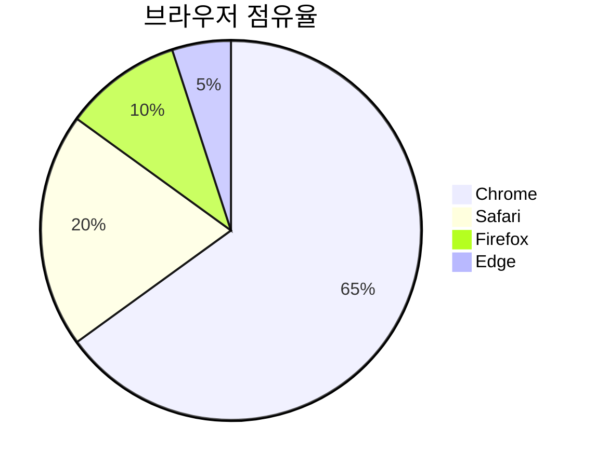

```text
pie
    title 브라우저 점유율
    "Chrome" : 65
    "Safari" : 20
    "Firefox" : 10
    "Edge" : 5
```

* `pie`: 파이 차트 다이어그램을 시작하는 키워드
* `title`: 차트의 제목 (선택사항)
* `"라벨" : 값`: 각 섹션의 라벨과 수치 (소수점 2자리까지 지원)
* 파이 조각은 작성한 순서대로 시계방향으로 배치됩니다

## 예제 1: 간단한 프로젝트 시간 배분

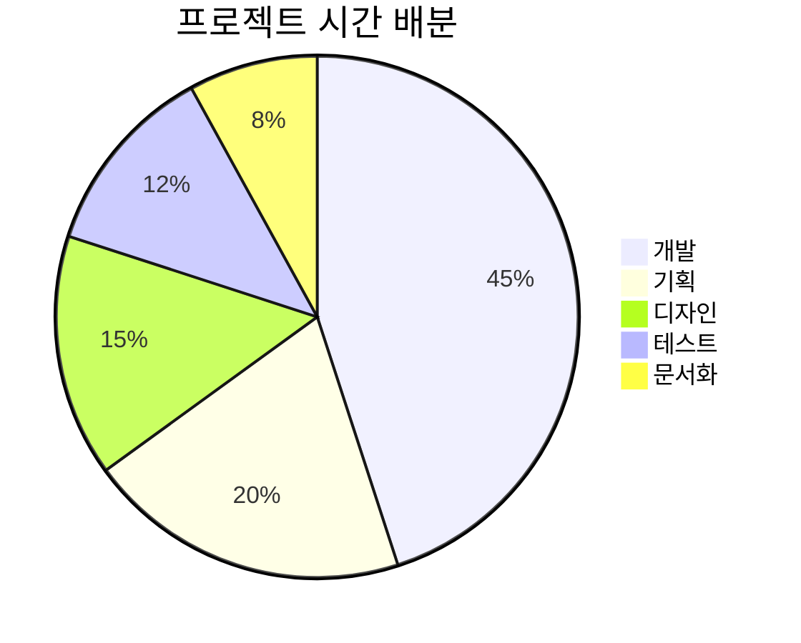

이 예제는 프로젝트에서 각 단계에 투입되는 시간의 비율을 보여줍니다. 개발이 45%로 가장 큰 비중을 차지하고 있음을 한눈에 파악할 수 있습니다.

## 예제 2: 데이터 값 표시하기

`showData` 키워드를 사용하면 범례 텍스트 옆에 실제 값을 표시할 수 있습니다.

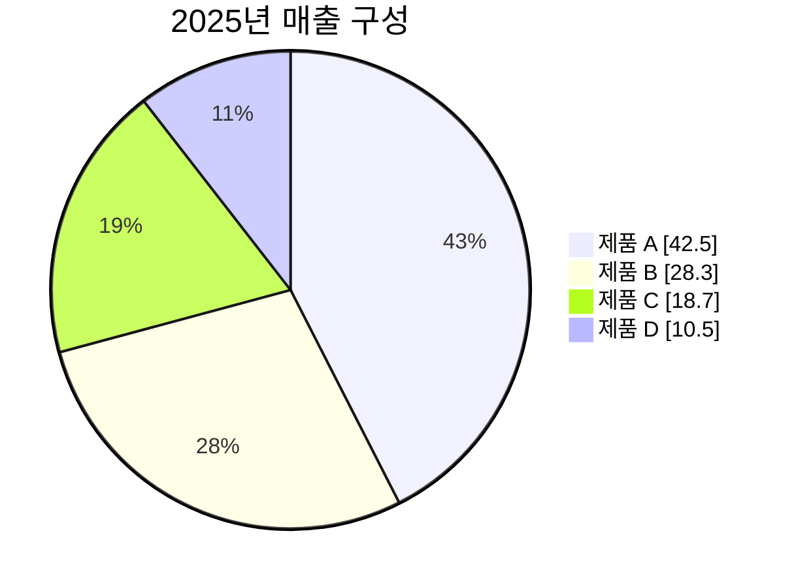

```text
pie showData
    title 2025년 매출 구성
    "제품 A" : 42.5
    "제품 B" : 28.3
    "제품 C" : 18.7
    "제품 D" : 10.5
```

`showData`를 추가하면 범례에 각 항목의 정확한 수치가 함께 표시되어 더 명확한 정보 전달이 가능합니다.
 
## 예제 3: 서비스 장애 원인 분석

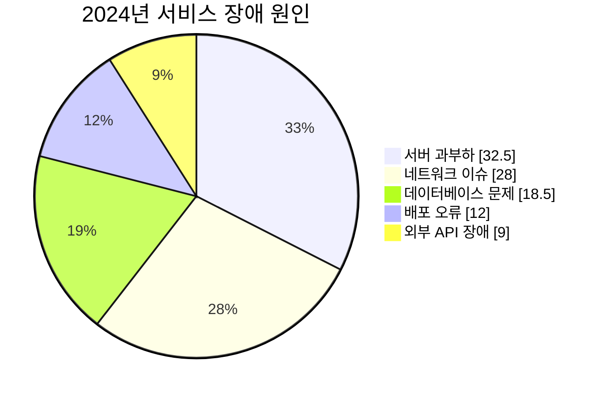

```text
pie showData
    title 2024년 서비스 장애 원인
    "서버 과부하" : 32.5
    "네트워크 이슈" : 28.0
    "데이터베이스 문제" : 18.5
    "배포 오류" : 12.0
    "외부 API 장애" : 9.0
```

서비스 장애의 원인을 분석하여 파이 차트로 표현하면, 어떤 부분에 우선적으로 개선 노력을 기울여야 하는지 결정하는 데 도움이 됩니다.

## 예제 4: 설문조사 결과

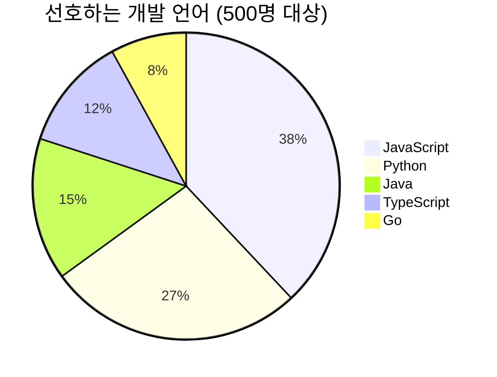

설문조사 결과를 파이 차트로 시각화하면 응답자들의 선호도를 한눈에 파악할 수 있습니다.

## 예제 5: 소수점 값 사용하기

Mermaid 파이 차트는 `소수점 2자리`까지 지원합니다.

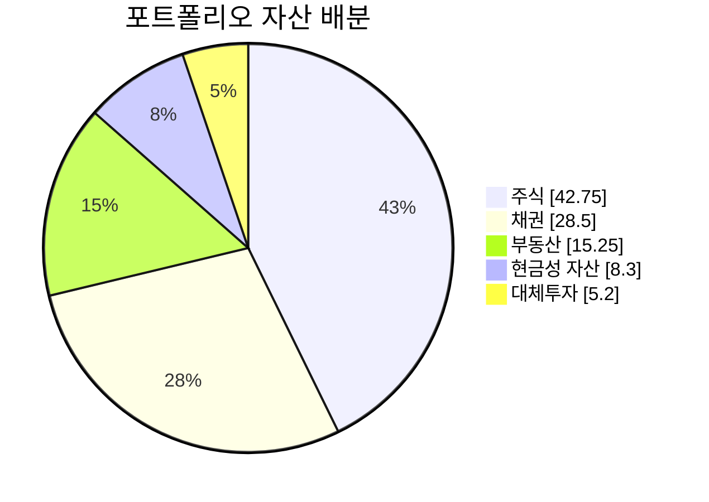

```text
pie showData
    title 포트폴리오 자산 배분
    "주식" : 42.75
    "채권" : 28.50
    "부동산" : 15.25
    "현금성 자산" : 8.30
    "대체투자" : 5.20
```

정밀한 비율 표현이 필요한 경우 소수점을 활용하여 더 정확한 데이터를 표현할 수 있습니다.

## 작성 팁

### 1. 적절한 카테고리 수

파이 차트는 5-7개 정도의 카테고리에서 가장 효과적입니다. 너무 많은 조각은 가독성을 떨어뜨립니다.

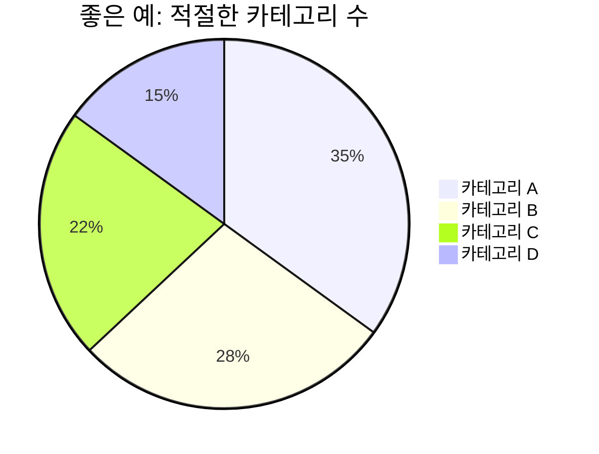

### 2. 의미 있는 라벨 사용

명확하고 구체적인 라벨을 사용하여 데이터의 의미를 정확히 전달합니다.

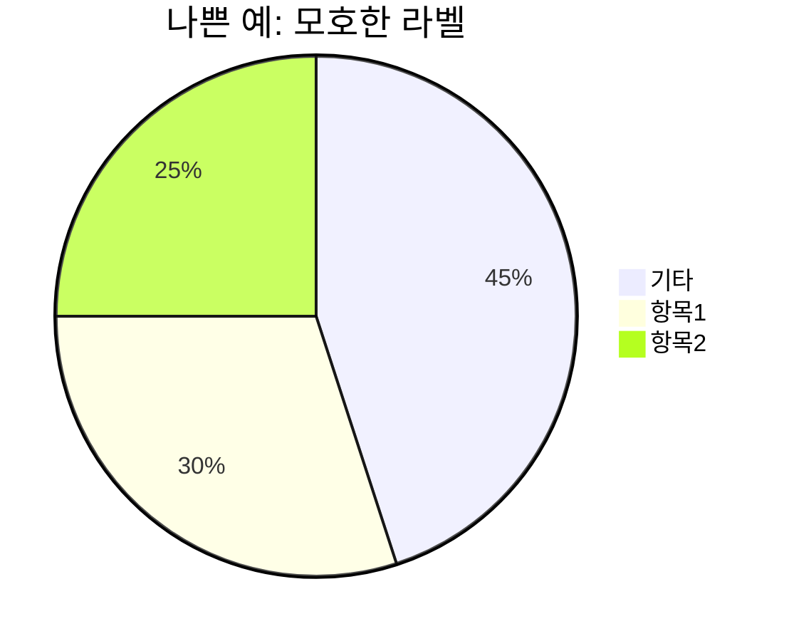

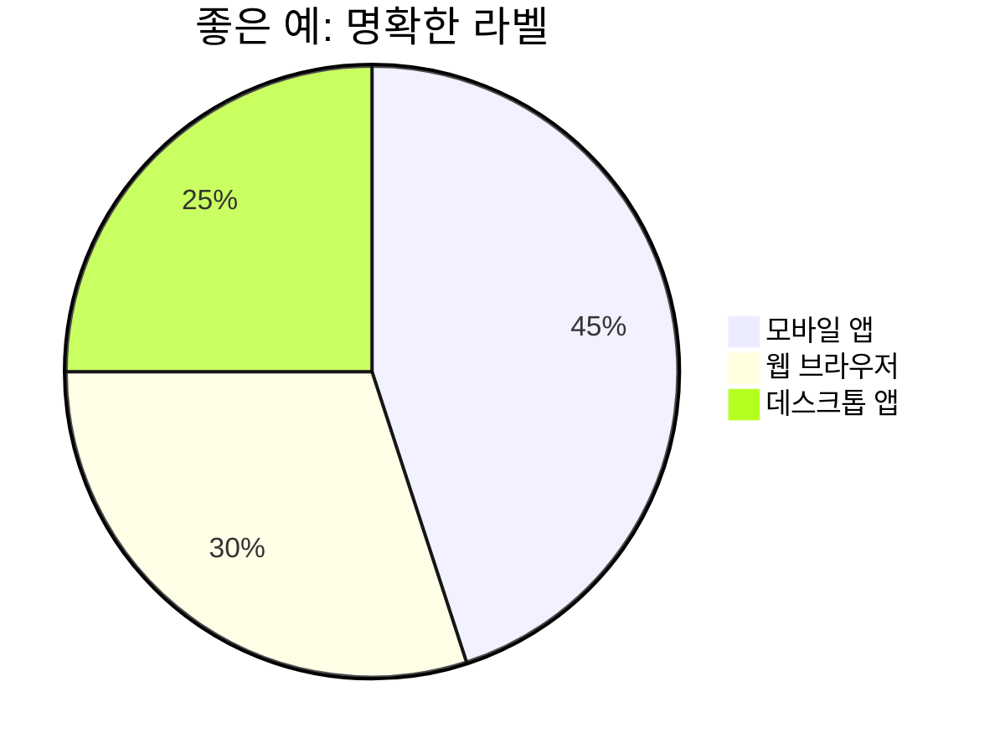

### 3. 순서 고려

가장 큰 값부터 작은 값 순으로 배치하면 읽기 쉽습니다. 다만, 시간 순서나 논리적 흐름이 중요한 경우는 예외입니다.

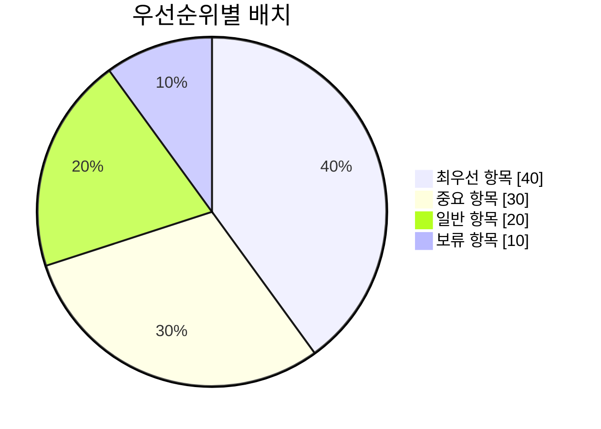

### 4. 100%를 채우기

파이 차트는 전체를 나타내므로, 가능하면 합계가 100이 되도록 조정하면 이해하기 쉽습니다. 하지만 Mermaid는 자동으로 비율을 계산하므로 반드시 100일 필요는 없습니다.

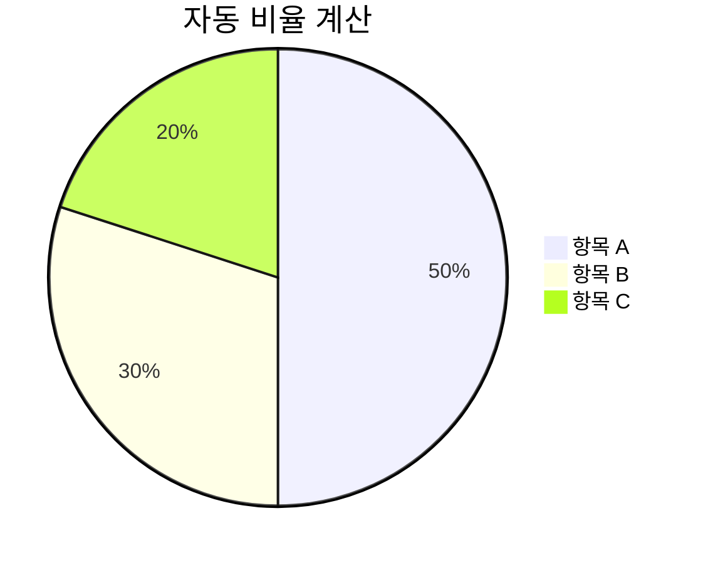

위 예제에서 총합은 500이지만, Mermaid가 자동으로 각각 50%, 30%, 20%로 표시합니다.

## 설정 옵션

파이 차트의 설정을 변경하려면 다음 파라미터를 사용할 수 있습니다:

| 파라미터         | 설명                              | 기본값  |
| ------------ | ------------------------------- | ---- |
| textPosition | 파이 조각 라벨의 위치 (0.0: 중심, 1.0: 외곽) | 0.75 |

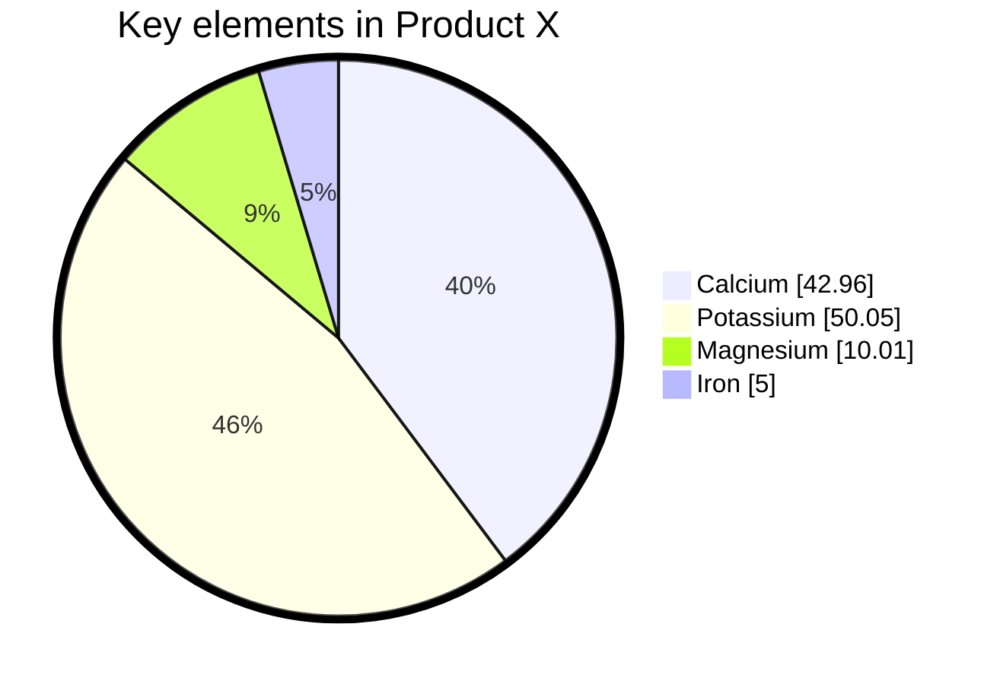

```text
---
config:
  pie:
    textPosition: 0.5
  themeVariables:
    pieOuterStrokeWidth: "5px"
---
pie showData
    title Key elements in Product X
    "Calcium" : 42.96
    "Potassium" : 50.05
    "Magnesium" : 10.01
    "Iron" :  5
```

## 언제 파이 차트를 사용하면 좋을까요?

### 사용하기 좋은 경우:

* 전체에서 각 부분이 차지하는 비율을 보여줄 때
* 카테고리가 5-7개 이하일 때
* 비교보다는 구성 비율이 중요할 때
* 하나의 시점 또는 상태를 나타낼 때

### 사용을 피해야 하는 경우:

* 시간에 따른 변화를 표현할 때 (라인 차트 사용 권장)
* 정확한 값의 비교가 중요할 때 (막대 차트 사용 권장)
* 카테고리가 10개 이상으로 많을 때
* 여러 데이터셋을 비교할 때

## 마무리

파이 차트 작성 시 다음을 기억하세요:

* `pie` 키워드로 시작하고 `showData`로 값 표시 가능
* 적절한 카테고리 수 유지 (5-7개 권장)
* 명확하고 의미 있는 라벨 사용
* 가장 큰 값부터 배치하여 가독성 향상
* 전체 비율 표현에 적합한 차트 유형

**공식 문서:** <https://docs.mermaidchart.com/mermaid-oss/syntax/pie.html>
